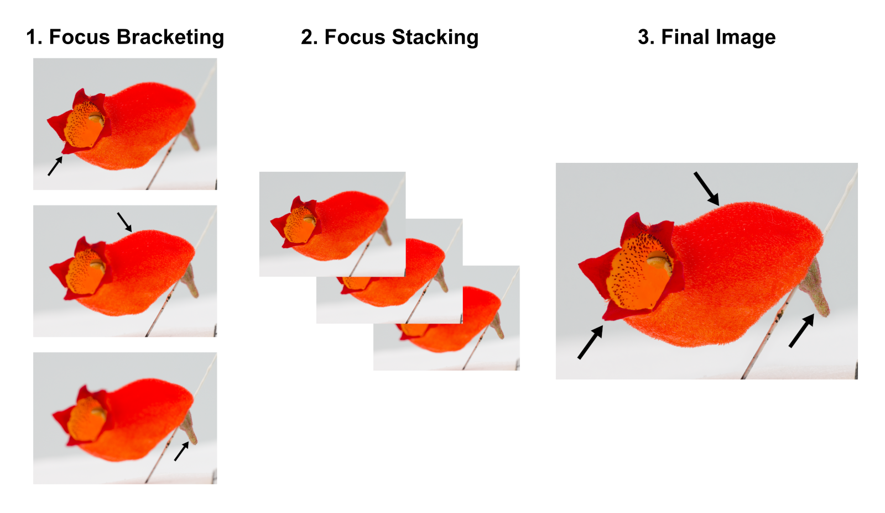
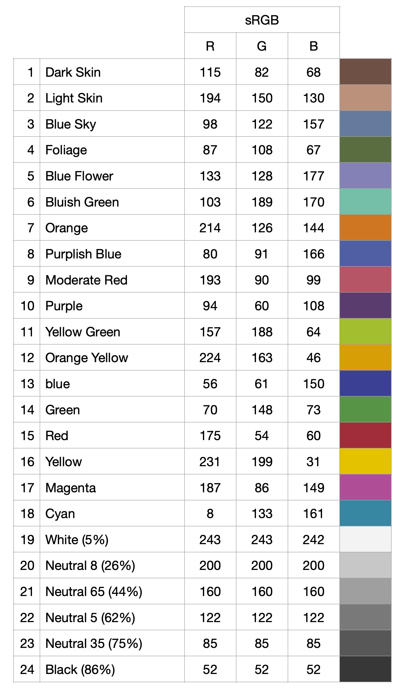

# Materials


## Lighting

It is important to have good lighting conditions to take the
photographs. To optimize the lighting conditions, we use a [Neewer
portable lighting box](https://neewer.com/collections/shooting-tent) to
recreate lighting studio conditions and reduce shading on the object to
a maximum. This lightbox needs to be powered from an outlet or from an
external battery. The color of the background used should contrast with
the color of the flowers to be photographed.


## Turntable

We use an automated turntable and shutter release device ([Syrp Genie
mini II and turntable](https://www.bhphotovideo.com/c/product/1486043-REG/syrp_sykit_0043_genie_mini_ii_turntable.html/quick-compare)) to rotate each flower around itself (360°) and trigger a predetermined number of pictures from the camera to get pictures from all around the flower. The Genie Mini II has several hours of autonomy depending on its use, but it can be plugged in a source of energy during the process (external battery, plug, or usb). This device is easily controlled and set remotely via its application \"Syrp\" (Figure \@ref(fig:Syrp)) on any kind of smartphone (although not all Android versions) with Bluetooth ([Appstore](https://apps.apple.com/us/app/syrp/id1387335063) or [Playstore](https://play.google.com/store/apps/details?id=nz.co.syrp.genie2&hl=fr_CA&gl=US)) after the device has been paired with your phone and after any updates suggested by the device has been done.

We also use a 1 cm scale placed adjacently to the flower, and include a label describing the species name, collection number, date of collection, location, and coordinates.

```{r Syrp, echo=FALSE, message=FALSE, fig.cap="Syrp application", out.width = '20%', fig.align='center'}
knitr::include_graphics("Figures/Syrp_app.png")
```


## Camera

It is important to have very sharp pictures for optimal model
reconstruction. Ideally, the whole flower should be in focus to maximize the amount 
of details captured. This could be achieved with focus bracketing (i.e., shooting a series of pictures of the flower at different focus distances) and subsequently, focus stacking (i.e., combining the series of pictures to produce a sharp image with a greater depth of field than any single image; Figure \@ref(fig:Focus-Stacking-Graphic)). Focus bracketing can be easily achieved with a camera that provides this option (we use Canon EOS 90D with a fixed macro lens EF 100mm f/2.8L MACRO IS USM), while focus stacking can be done using software like Helicon Focus (paid) or Enfuse (free in Linux). 


```{r Focus-Stacking-Graphic, echo=FALSE, message=FALSE, fig.cap="A simplified visual summary of the focus stacking process. (1) Focus bracketing: The camera shoots a series of pictures at different focus distances. (2) Focus Stacking: The series of pictures is combined using specialised software. (3) Final Image: The final image is sharp, with a greater depth of field than any single image taken during focus bracketing. The black arrows show the parts of the flower in focus.", out.width = '100%', fig.align='center'}

```


However, using a professional camera and doing focus bracketing and stacking are not necessary. We also
obtained good results with a Canon T2i/550D camera that shoots 18.0 MP
RAW photos (5184 x 3456 pixels) and a fixed macro lens (60mm f/2.8 Macro lens). 

In general, avoid using a lens that isn't fixed; zooming
in and out can create artifacts during the model reconstruction. Ideally
the flower should take a large portion of the photographs for best
results. Depending on the weight of the camera, a flexible or a rigid tripod could be used. If a short flexible table-top tripod can safely support your camera and prevent its movement during the shooting, we recommend it for easier and quicker modification of the camera angle at which we take each series of photos. Otherwise, opt for a rigid collapsible tripod, as it is crucial to avoid camera movement, especially during focus bracketing. 


## Color chart

To calibrate the photos for color, we use a [Xrite ColorChecker Passport
Photo
2](https://www.xrite.com/categories/calibration-profiling/colorchecker-classic-family/colorchecker-passport-photo-2).
The main target that we use is the classic target with a 24-patch color
reference target to create Digital Negative (DNG) (@Adobe2012DNG) camera
profiles from a raw photo (called DNG conversion), and the 75% neutral
gray patch to calibrate for light exposure.

```{r xrite, echo=FALSE, message=FALSE, fig.cap="Xrite color chart details for standard Red Green and Blue (sRGB) values. The 75% neutral gray has values of 0.33 (85/255) for Red Green Blue channels in the LightRoom software", out.width = '50%', fig.align='center'}

```


## Softwares

To convert RAW photos (CR2 or CR3 for Canon Raw Version 2 or 3 image files, respectively) to DNG
files, we either use directly [Adobe Lightroom
Classic](https://www.adobe.com/ca_fr/products/photoshop-lightroom-classic.html)
to export in DNG format the CR2 photos or [Adobe DNG
converter](https://helpx.adobe.com/camera-raw/using/adobe-dng-converter.html).
To calibrate the photos according to the color chart, we use the [Xrite
Color
Checker](https://xritephoto.com/ph_product_overview.aspx?ID=938&Action=Support&SoftwareID=2030)
software to create DCP camera profiles from DNG files, and Adobe
Lightroom to use these profiles and apply them on an entire set of
photos that need the same calibration. To do focus stacking, we first cluster the series of images to be combined based on time intervals using ExifTool and then we use Helicon Focus to stack them. Both can be easily done from the command line using the python scripts provided by the [Eaton Lab](https://github.com/yuemeanshappy/photogram). To reconstruct the 3D models from photos, we use [Agisoft Metashape](https://www.agisoft.com/downloads/installer/).


## Flowers

Collect fresh flowers from the plant, label them and store them in a
cool place or with the tip of the pedicel in some water to prevent
accelerated wilting. Different flowers will wilt at different paces.
Flowers are pinned through the floral receptacle or pedicel using
entomological pins in dense foam at the center of the turntable.
Alternatively, flowers can be secured in a truncated pipette tip, itself
fixed on the turntable, or with alligator clips to rapidly fix the
flowers.

>Store flowers in 50mL Eppendorf tubes or in foam box no more than an
hour before taking photos of them.

>In some cases, it is necessary to remove sepals from the flower before
building the model to accurately study the corolla shape. To do this,
use a razor blade and mark the sepal intersections with a waterproof
pen. The marks will help for the model construction and more importantly
landmarks positioning.


## Summary of materials and software


| **Materials** | **Description** | **Price** (USD) |
|---|---|---|
| **Photography** |  |  |
| Camera | Digital Single-Lens Reflex (DSLR) (e.g., Canon t2i or Canon EOS 90D for taking images without or with focus bracketing, respectively) | from  $500 |
| Macro lens | A preferably fixed focal-length lens (e.g., Canon 60mm f/2.8 Macro lens for the Canon t2i camera, or Canon EF 100mm f/2.8L MACRO IS USM for the Canon EOS 90D camera) | from  $400 |
| Tripod | Preferably flexible (e.g. Gorillapod), or collapsible | from  $30 |
| Stepping motor and turntable kit | [Syrp Genie mini II and turntable](https://www.bhphotovideo.com/c/product/1486043-REG/syrp_sykit_0043_genie_mini_ii_turntable.html/quick-compare), used to shoot smooth rotating video and interactive 360° images of objects. Full iOS and Android App control via Bluetooth. Battery life: 6hrs video and 15hrs time-lapse. Panning payload 8.8lbs/4kgs | $328 |
| Lightbox | A portable photo studio, e.g. [Neewer](https://ca.neewer.com/collections/softboxes-diffusers/products/neewer-professional-photo-light-box-kit-66600325) Lightbox 20"/50cm foldable portable photography lighting kit (Neewer Technology Co. LTD, Shenzhen,  China), adjustable brightness with 120 LED lights, CRI (colour Rendering Index) of 85+, 6000-6500K colour temperature, needs to be powered by a portable battery in the field and comes with white, grey, black and orange backdrops. In the bracket of light intensities possible for this lightbox, we used an intermediate light intensity. [maximum;usually used; minimum] lux light intensities correspond to [3140;2680;1330] lux for a white backdrop and [330;305;238] lux with a black backdrop. | e.g. $89 |
| External battery | Powering source for in-field photo capture, essentially for the lightbox or to recharge batteries | optional |
| **Flower mounting and identification**
| Flower | Freshly cut flower with pedicel and floral receptacle | / |
| Labels and container | Identification and storage of fresh flowers to avoid damage and avoid wilting | / |
| Turntable labels | To provide information on species, collector, collection number, date, locality, and coordinates, and the chunk number. To use as a separate photo before each run of photos. | / |
| Razor blade | To remove flower parts (e.g., sepals) | / |
| Small block of dense foam attached to the center of a paper disk | To fix flowers in place with a pin at the center of the turntable. The foam and the paper disk should have the same color as the backdrop used. | / |
| Entomological pins | To pin through the peduncle or floral receptacle and fix the flower on the turntable. | / |
| Scale | A 1 cm scale to use as reference | / |
| **Colour calibration** |  |  |
| Color chart | A color reference to calibrate RAW photos (e.g. [X-rite ColorChecker Passport](https://www.xrite.com/categories/calibration-profiling/colorchecker-targets/colorchecker-passport-photo-2)) | e.g.  $90 |
| Color calibration software | ColorChecker Camera Calibration, Xrite software for automatic color profile creation | Free |
| Photo editing software | Adobe Photoshop Lightroom, editing software for image color calibration in batch | Payment plans vary |
| DNG conversion software | Adobe DNG converter, to convert Camera Raw files from supported cameras to the more widely used DNG raw files | Free |
| **Focus stacking (optional)** |  |  |
| Image clustering software | [ExifTool](https://exiftool.org/), to cluster the images taken with focus bracketing from each angle based on time intervals | Free |
| Focus stacking software | [Helicon Focus Pro](https://www.heliconsoft.com/heliconsoft-products/helicon-focus/) (Mac OS X, Windows) or [Enfuse](https://enblend.sourceforge.net/enfuse.doc/enfuse_4.2.xhtml/enfuse.html) (Linux), to focus stack the clustered images and produce a sharp image with a high depth of field  | Payment plans vary |
| Python scripts | [Python scripts](https://github.com/yuemeanshappy/photogram) developed by the Eaton Lab to use ExifTool and Helicon Focus through the command line for faster processing | Free |
| **Model reconstruction** |  |  |
| 3D reconstruction from photogrammetry software | Agisoft Metashape Pro Software | $549 Academic price |

