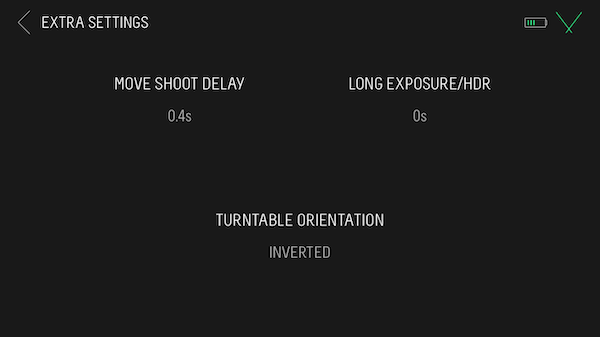

# Settings and preparation

## Camera and tripod settings and preparation

To obtain the best picture quality for model reconstruction, we need an optimal combination of the light sensibility of the sensor (ISO), the duration of exposure and the focal of the objective (F). As mentioned, it is preferable to use a fixed lens (one that doesn't allow zooming) to facilitate the model reconstruction in the processing step because the software can't take zooming into account in the reconstruction process. Maximizing the light source allows us to use the lowest ISO to get crisper images. Adapted time exposure to allow the right amount of light to go to the sensor, avoids low key nor high key photo (under/over exposed photo). This may be adapted according to the subject (light or dark colored subject or background) or if different lighting conditions are used.

To maximize the depth of field without lowering the image quality, using the manual option on the camera dial, the focal F should be set to F16. Use the manual focus setting on the side of the lens (Figure \@ref(fig:camera-arrows)) to avoid camera trigger malfunction when the flowers doesn't land on the detector. If the flower is off centered during rotation, and the automatic focus can't focus (on the background) the camera trigger is prevented with the automatic focus. On manual, the camera will always be triggered by the turn table, even if the focus isn't optimal. Because the subject is moving and may be off centered on the turntable, the focus may need to be adapted while the turn table runs. For this you can pause the turntable, manually adjust the focus, and resume the spin.

```{r camera-arrows, echo=FALSE, message=FALSE, fig.cap="Camera and lens used to take RAW photos. The red arrows (from top to bottom) depict the button to get manual focus, the ISO button and the manual parameter on the camera dial.", out.width = '33%', fig.align='center'}
knitr::include_graphics("Figures/camera_arrows.png")
```

A flexible tripod (Figure \@ref(fig:tripod)) is used to adjust several camera heights, high, middle, and low, close to the subject.

```{r tripod, echo=FALSE, message=FALSE, fig.cap="Flexible tripod used to adjust camera positions.", out.width = '33%', fig.align='center'}
knitr::include_graphics("Figures/tripod.png")
```


### Camera settings

The standard settings have to be adjusted depending on the flower
(colour mostly and conditions). We often use the following settings :
exposure time (shutter speed) 1/20s, F/16 focal, ISO 100, standard
exposition on the light meter, and we save pictures as RAW files (ML
setting on the camera display) format to be able to post-process them
for color calibration (Figure \@ref(fig:camera-settings)). A RAW photo of the color chart with an
identical set of lighting conditions and camera settings as the flower
to be photographed is needed for each flower photos series. If several
flowers are processed one after the other without variation of light
conditions, only one chart photo is needed.

>The nicer and the sharper the photographs, the easier it will be to
build the models. So make sure that the flower is always in focus. Shade
or high light reflectance can also impair model reconstruction, so pay
attention to these while taking the pictures.

```{r camera-settings, echo=FALSE, message=FALSE, fig.cap="Camera settings interface of the Canon t2i/550D.", out.width = '50%', fig.align='center'}
knitr::include_graphics("Figures/camera_settings.JPG")
```


### Optional : custom camera white balance

Optionally, you can begin by setting a personalized white balance (WB) in
your camera with the light gray scale on the chart :

1.  For a Canon camera, take a picture of the gray scale;

2.  Choose *Custom WB* in your camera settings (Figure \@ref(fig:WB));

3.  Select *Custom* and use the picture of the grey scale to define your custome white balance (Figure \@ref(fig:WB2)). Be careful, you will still require to linearize and calibrate each photo afterwards.

However, the color chart will always be the reference for
post-processing the color calibration of each photo. This optional
section only helps to have a better preview of the photos.

```{r WB, echo=FALSE, message=FALSE, fig.cap="Custom whhite balance parameter.", out.width = '50%', fig.align='center', fig.show = 'hold'}
knitr::include_graphics("Figures/Custom WB setting.png")
```

```{r WB2, echo=FALSE, message=FALSE, fig.cap="How to select a custom white balance.", out.width = '50%', fig.align='center', fig.show = 'hold'}
knitr::include_graphics("Figures/Custom WB selection.png")
```


## Turn table settings and preparation

For each run (one 360 spin of the turn table), we use a wait time of 2s
to allow the camera time to save the images on the SD card after it is
triggered, and the flower to stabilize after each rotation.

1.  Connect the shutter release to your camera and the turntable Syrp
    Genie II (Figure \@ref(fig:shutter)).

2.  Turn the turntable on (to turn it off, hold the *on* button for 3
    seconds).

3.  Connect the Syrp Genie II to your device, and do the updates if
    required (needs an internet connection).

4.  Click on *create content* \> *turntable* (Figures
    \@ref(fig:genie-root), \@ref(fig:genie-content)).
    
5.  Make sure the turntable orientation is inverted in the detailed settings
    (Figure \@ref(fig:genie-settings))

5.  In parameters (Figure \@ref(fig:genie-record)), select 20 photos for 
    each run, and 2s of
    waiting (move-wait-shoot-wait-move). If it is too quick, some
    pictures won't be able to be saved as the camera needs a delay to
    save them on the memory card. The spinning device will take the
    first picture then proceed to a move-shoot-move run until the last
    photo.

6.  Place the white background circle on the turntable to contrast with
    the flower. If your flower is pale, then use a different background
    (colored or darker). Ideally, the color of the circle should be the
    exact same color of the background of the lightbox as this will help
    when applying masks later.

```{r shutter, echo=FALSE, message=FALSE, fig.cap="Camera shutter release port.", out.width = '50%', fig.align='center'}
knitr::include_graphics("Figures/shutter.jpg")
```

```{r genie-root, echo=FALSE, message=FALSE, fig.cap="Camera shutter release port.", out.width = '50%', fig.align='center'}
knitr::include_graphics("Figures/genie_root.PNG")
```

```{r genie-content, echo=FALSE, message=FALSE, fig.cap="Camera shutter release port.", out.width = '50%', fig.align='center'}
knitr::include_graphics("Figures/genie_create.PNG")
```

```{r genie-settings, echo=FALSE, message=FALSE, fig.cap="Genie detailed settings.", out.width = '50%', fig.align='center'}

```

```{r genie-record, echo=FALSE, message=FALSE, fig.cap="Start recording with the turntable.", out.width = '50%', fig.align='center'}
knitr::include_graphics("Figures/genie_turntable_20_1.PNG")
```


## Summary of settings

::: tabular
L4cm\|L12cm **Parameter** & **Description**\

------------------------------------------------------------------------

\
Aperture & F/16\

------------------------------------------------------------------------

Sensibility & ISO 100 (lowest)\

------------------------------------------------------------------------

Exposure time & 1/20s - Can be adapted according to the flower.
**Reminder** : a photo of the color chart in the exact same light
conditions and camera parameters as the flower needs to be taken.\
\
Number of photos & 20 per 360 for one camera position and one flower
position. May be adjusted according to each flower.\

------------------------------------------------------------------------

Wait time & 2s\

------------------------------------------------------------------------
:::