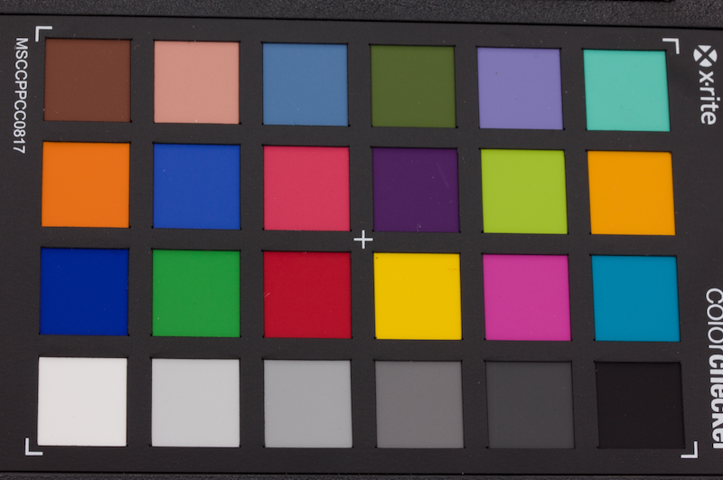
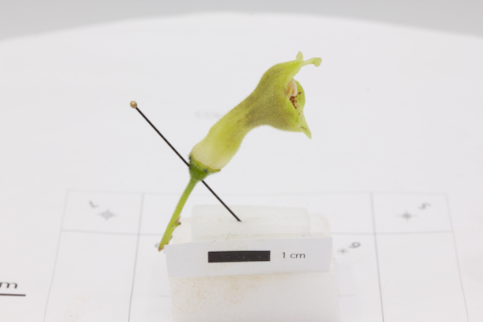
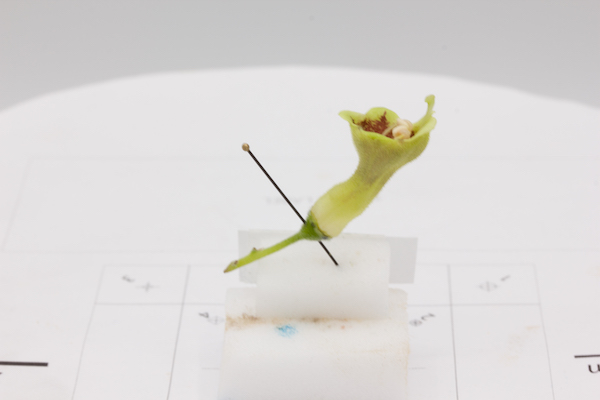
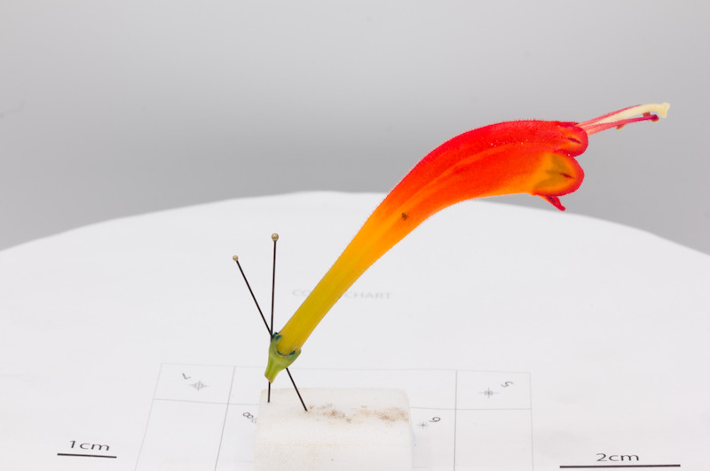
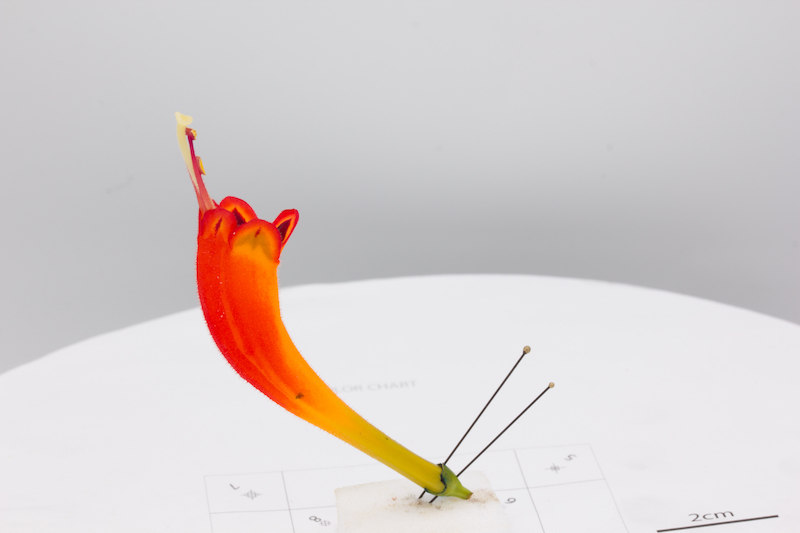
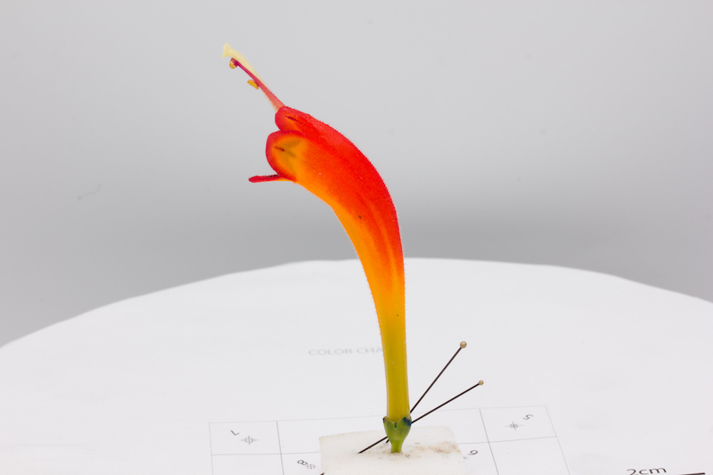
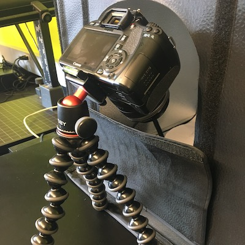
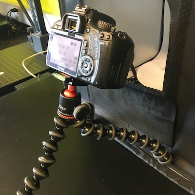
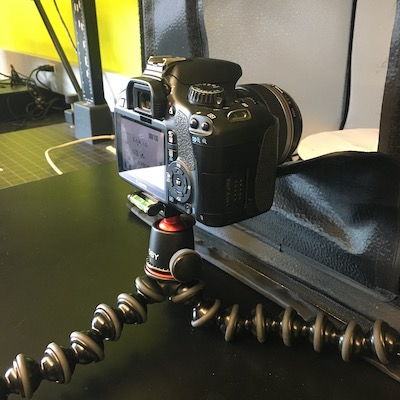

# Image capture step-by-step


## Take a picture of the color chart

1.  Camera settings:
      a.  **Without focus stacking**: Set the camera settings to F/16, ISO 100, 
          1/20s, and RAW format.
      b.  **With focus stacking**: Set the camera settings to F/11 (depends on 
          the ideal settings of your camera and lens for focus bracketing), ISO 
          100, 1/20s, and RAW format.

2.  Verify that you have enough space on your SD card for RAW photos:
      a.  **Without focus stacking**: A minimum of 163 photos, accounting for 
          photos of labels and chart.
      b.  **With focus stacking**: The total number of photos depends on the number of 
          shots at each rotation point and the number of flower positions 
          used (usually around 1,500 photos +-200).

3.  Verify that the placement of your turntable inside the lightbox will
    allow to capture correctly the flower you are about to photograph
    (distance from opening of the lightbox) and that the 1/20s shutter
    speed captures enough light from your flower by taking an initial
    photo of your flower.

4.  If satisfactory go to the next step. The goal here is to have a definite
    set of settings that will match both your flower photos and a color
    chart to subsequently calibrate all your photos that have the same
    light conditions and camera settings.

5.  Place the color chart where the flower will be placed, without
    shadows, and exposed under the same light as the flower will be
    (angled towards the LED source light in the lightbox). The camera
    settings and lighting cannot be changed after this. If the lighting
    or the camera settings are modified, the color chart needs to be
    taken again to correct the corresponding photos.

6.  Place the camera so that the entire chart is visible.

7.  Take a picture of the color chart in RAW format (if you are doing focus stacking 
    for your project, disable the focus bracketing function for this step). Make 
    sure to incorporate all color squares and the corners of the chart as shown below (Figure \@ref(fig:chart)).
    
```{r chart, echo=FALSE, message=FALSE, fig.cap="Colour chart photo taken at the beginning of the process to calibrate the photos in post process.", out.width = '40%', fig.align='center'}

```


## Flower placement & image capture

To reconstruct an accurate 3D model, it is very important to have
pictures of all the parts and details of the flowers and from several
angles. Also, the photographs need to overlap with each other for proper
alignment in the first steps of the reconstruction. For this reason,
several pictures will be taken of each flower, from different
perspectives and all around the flower. We suggest that flowers are
photographed from at least two positions (e.g., Figure \@ref(fig:flower-two-positions)). For more complex flowers, three positions may be required: horizontal, vertical, and upside down (Figure
\@ref(fig:flower-three-positions)). Note that it is better to take
more photos than less because if we can drop some pictures during the
model reconstruction, it is impossible to come back and take more
pictures if we realize that we should have.

```{r flower-two-positions, echo=FALSE, message=FALSE, fig.cap="Two flower positions that are normally suficient for Gesneriaceae flowers.", out.width = '33%', fig.align='center', fig.show = 'hold'}


```

```{r flower-three-positions, echo=FALSE, message=FALSE, fig.cap="More complex flowers can require the pictures to be taken from three flower positions.", out.width = '33%', fig.align='center', fig.show = 'hold'}



```

>For Gesneriaceae, we first suggest a standard and an
upside-down position (Figure \@ref(fig:flower-two-positions)) of the flower as this generally gives satisfactory results. For more complex flowers, three positions may be required: horizontal, vertical, and upside down (Figure
\@ref(fig:flower-three-positions)).


1.  Clip the camera on the tripod and place it at one of the three position required per flower position:
    high, mid, and low position (see Figure \@ref(fig:camera-positions).
    Make sure to not use different camera orientations (landscape vs. portrait).

2.  If sepals need to be removed, use a razor blade to cut them at the
    base and mark the sepal intersections with a waterproof pen to keep
    track of the morphological structures.

3.  Pin the flower through the pedicel or the floral receptacle and
    through a block of dense foam or malleable gum using an entomological pin. 
    You can use several pins to avoid any sliding of the flower during the image 
    capture process.

4.  Make sure to place the flower so that it is wholly
    encompassed in the camera frame as much as possible. It is best to
    have the subject take as much space as possible in the camera
    frame to capture every details overall than having it entirely in
    the camera frame but with poor detail quality. What counts the most
    is getting several overlapping photos of each feature. Make sure
    that the flower is not in contact with anything as this would deform
    it and create problems during the model reconstruction.

5.  For flowers with very uniform color or with radial symmetry, it may
    be helpful to place dots on the corolla using a waterproof pen to
    facilitate manual marker positioning and/or automated pixel position
    detection in the reconstruction step.

6.  Place a scale (e.g., 1 cm) directly below the flower.

7.  Take a picture of the flower with the label for each new positioning
    of the flower. This will help to identify each group of images during model reconstruction.
    
8.  If you are doing focus stacking, enable *Focus Bracketing* function at this point and 
    optimize the number of shots and focus increments so that you get each 
    flower part in focus in at least one image. Tap on the part of the flower that 
    is nearest to the lens before the first picture is taken at each rotation point, 
    if it is not already in focus at that moment.

9.  Press the *REC* button on your smartphone using the turntable
    interface to start the spin of the turntable and automated image
    capture.

10. Verify occasionally the focus on the flower while the flower rotates
    by pressing the square button (stop) and manually adjust the focus
    if needed, then press *REC* to resume your spin. You can also help the camera 
    focus by tapping on the flower before the camera is triggered at each rotation point. 

```{r camera-positions, echo=FALSE, message=FALSE, fig.cap="The three camera positions from which pictures should be taken for each flower position.", out.width = '33%', fig.align='center', fig.show = 'hold'}



```


>Adjust the number of flower positions and number of photos according to each flower. For intricate flowers, or flowers that can't be captured entirely with only two positions (ventral and dorsal), you can place the flower on an another position (Figure \@ref(fig:flower-three-positions)). On the contrary, if the flower can't be placed on several positions, you may need to increase the number of photos per camera height in order to have sufficient information for the software to reconstruct accurate 3D models.
