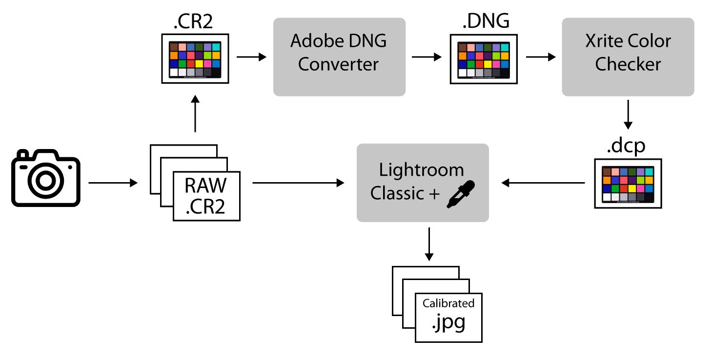
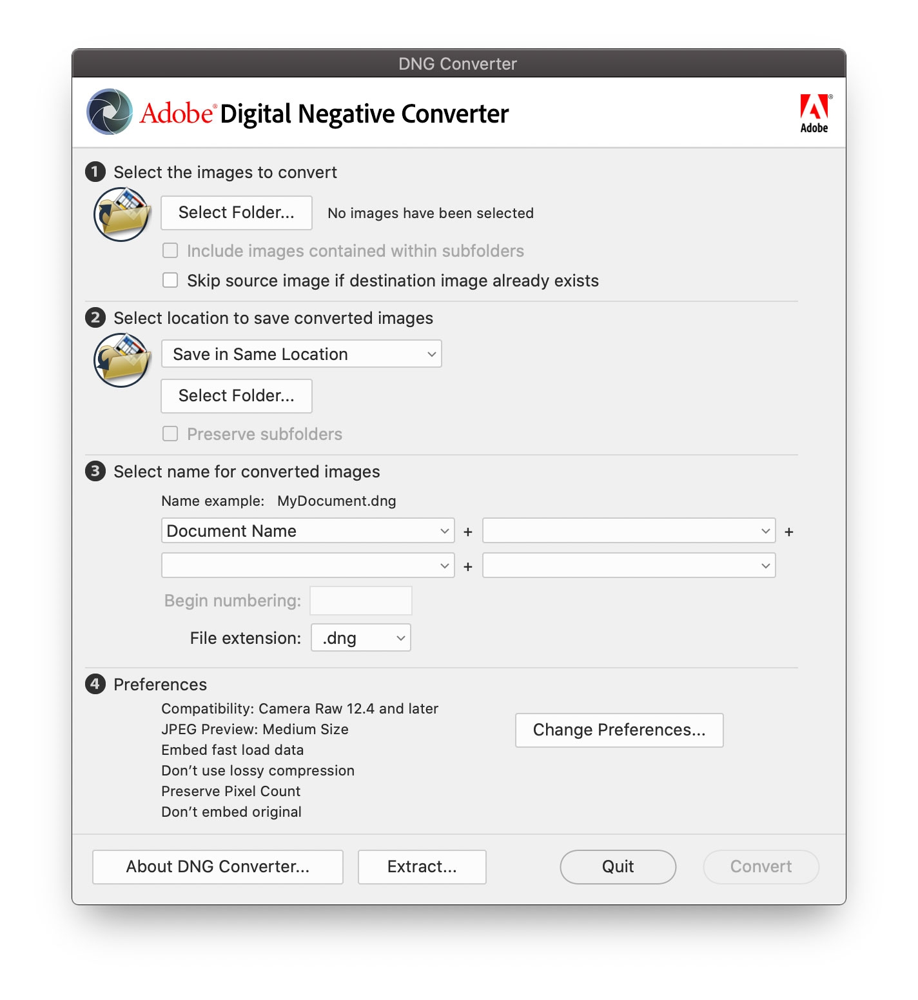
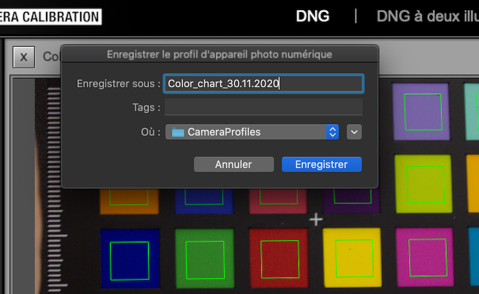
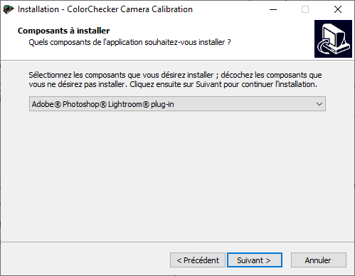
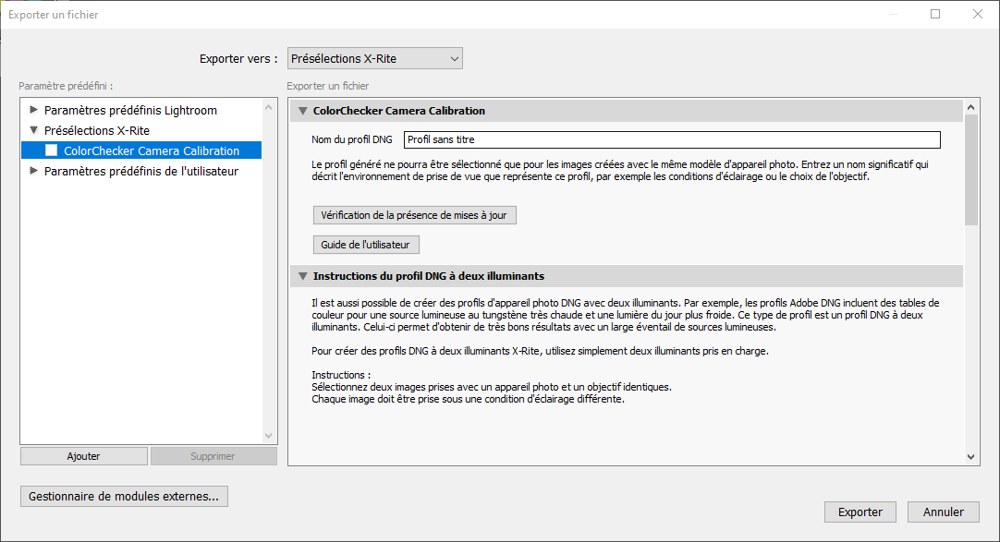
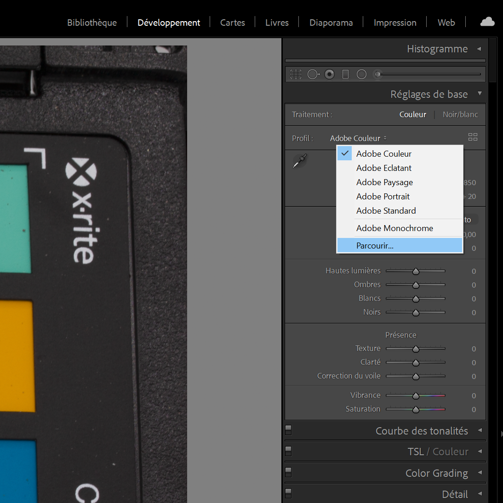
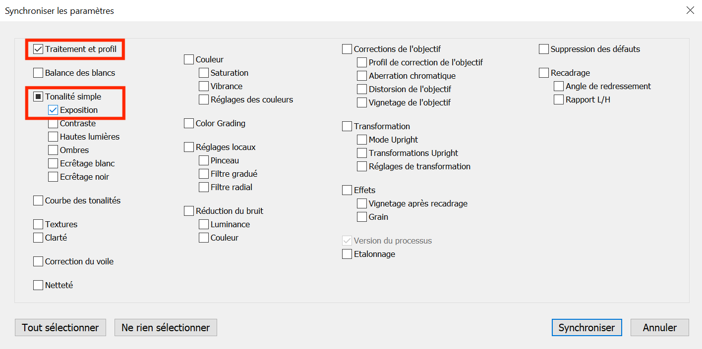
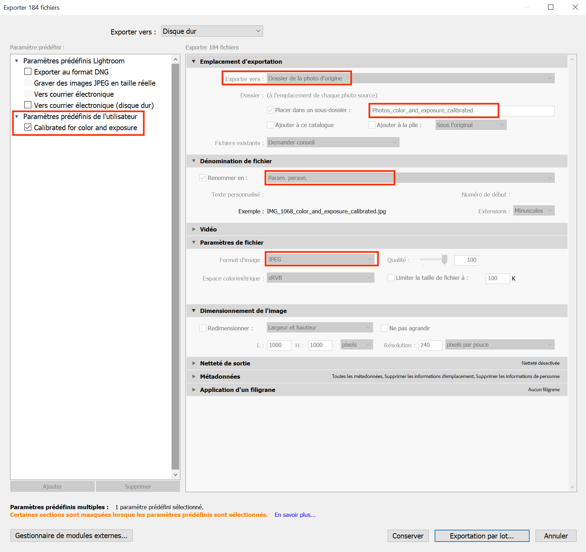

# Image post processing


## File names and storage

We found that it is critical to have a very organized structure for
saving files, especially when several people are working on the same
project. We propose here what has been working so far for us.

In a species folder named with the name of the species
(*Genus_species*), there should be a distinct folder for each individual
photographed, usually with a different collection number. If the same
individual has been photographed several times, the date of photos
acquisition should be appended to the folder name to discriminate them.
We also indicate in the folder name whether the individual has been
photographed with or without sepals.

For each flower, we have one folder for uncalibrated photos, one for
calibrated photos, and one for the model. The RAW picture of the color chart
should be placed in the uncalibrated photos.

To distinguish which photo goes in which chunk, a photo of the label is
taken at the beginning of each chunk (each set of photos per side of
flower). We suggest to place the photos from different chunks in
different folders once the photos are calibrated. The date of when the
photos are taken is important because it helps matching the calibration
to the right DNG file. If more than one set of photos with different
lighting or camera settings are taken, make sure to distinguish the
color charts that correspond to each set of photos.


>Genus_species\
&emsp;GEN_species_CollectionNumber\
&emsp;&emsp;sepal_DD.MM.YYYY or no_sepals_DD.MM.YYYY\
&emsp;&emsp;&emsp;Model\
&emsp;&emsp;&emsp;&emsp;*MetashapeProject*\
&emsp;&emsp;&emsp;&emsp;*MetashapeProjectFolder.files*\
&emsp;&emsp;&emsp;&emsp;*model.obj*\
&emsp;&emsp;&emsp;&emsp;*model.ply*\
&emsp;&emsp;&emsp;&emsp;*texture.jpg*\
&emsp;&emsp;&emsp;01_Photos_to_calibrate\
&emsp;&emsp;&emsp;&emsp;*Place here all the RAW photos and color chart*\
&emsp;&emsp;&emsp;02_Photos_calibrated\
&emsp;&emsp;&emsp;&emsp;*Place here all the calibrated photos, that you can organize per chunk*\

\

If you are doing focus stacking, you can also create the following two folders in addition to the above:

>&emsp;&emsp;&emsp;03_Photos_clustered\
&emsp;&emsp;&emsp;&emsp;*Place here the calibrated photos that have been clustered based on time intervals into separate                         subfolders containing series of pictures taken using the Focus Bracketing function at each                              rotation point*\
&emsp;&emsp;&emsp;04_Photos_focus_stacked\
&emsp;&emsp;&emsp;&emsp;*Place here all the final images after focus stacking*\


## Image color calibration

### Creating color profiles

We present here three ways to create camera profiles. The first one
allows to manually check the automatic detection of the color chart, the
second and third ones are fully automatic (on MacOS and windows
respectively).

This does not linearize the photos. For further details on color
calibration, read @troscianko2015image.

**Method 1 : Manual creation of color profiles**

1.  This method uses the [Xrite ColorChecker Camera Calibration
    software](https://xritephoto.com/ph_product_overview.aspx?ID=938&Action=Support&SoftwareID=2030)
    and [Adobe DNG converter
    software](https://helpx.adobe.com/photoshop/using/adobe-dng-converter.html) (Figure \@ref(fig:ColorCheckerworkflow)).

2.  Create a new empty folder called DNG.

3.  Copy the RAW file representing your color chart in your DNG folder,
    and rename it accordingly (e.g. Color_chart_DD.MM.YYYY).

4.  Open DNG converter and select the DNG folder you created in the
    first step. You can't select a specific file, you need to select a folder, 
    and the software will convert all the files within this folder.
    Default parameters are fine for step 2-4. It will export the RAW file
    in the DNG folder to a DNG file with the same file name (Figure \@ref(fig:DNG)).

5.  Open the Color Checker Camera Calibration software and drag and drop
    the newly created DNG file in the software. The software will
    automatically draw a grid around it. Make sure that the green grid
    fits the chart, avoiding edge effects on each square of color
    (Figure \@ref(fig:Colorcheckercalibration).

6.  Click on *Create Profile* and save it under Color_Chart_DD.MM.YYYY
    (Figure \@ref(fig:ColorCheckerprofile).

```{r ColorCheckerworkflow, echo=FALSE, message=FALSE, fig.cap="Image color calibration workflow.", out.width = '80%', fig.align='center', fig.show = 'hold'}

```

```{r DNG, echo=FALSE, message=FALSE, fig.cap="Convert RAW chart to DNG in Adobe DNG Converter.", out.width = '80%', fig.align='center', fig.show = 'hold'}

```

```{r Colorcheckercalibration, echo=FALSE, message=FALSE, fig.cap="Align grid on chart in ColorChecker Camera Calibration.", out.width = '80%', fig.align='center', fig.show = 'hold'}
knitr::include_graphics("Figures/ColorChecker_camera_calibration.png")
```

```{r ColorCheckerprofile, echo=FALSE, message=FALSE, fig.cap="Export the color profile.", out.width = '80%', fig.align='center', fig.show = 'hold'}

```


**Method 2: X-Rite Color Checker plug-in installation and automatic creation of color profiles on MacOS**

1.  Directly in Adobe Lightroom, you can add ColorChecker Camera
    Calibration as a module to a means of exporting files directly into
    a color profile.

    1.  Click on *File* \> *Export* \> *Plug-in Manager* (or *gestionnaire
        des modules externes* in the left bottom corner).

    2.  Click on *Add*.

    3.  Navigate to *Library* \> *Application Support* \> *Adobe* \>
        *Lightroom* \> *Modules*.

    4.  Select *XRiteColorCheckerPassport.lrplugin* and then click on
        *Add Plug-in* and *Done*.

2.  Click on the color chart then *File* \> *Export* \> Choose *Xrite
    presets* from the drop down menu.

3.  Name your profile then \> *Export*.

4.  It will go through ColorCheckerCamera calibration to automatically
    create the profile.

5.  Restart Lightroom as indicated.

**Method 3: X-Rite Color Checker plug-in installation and automatic
creation of color profiles on Windows**

1.  Get the [Xrite ColorChecker Camera Calibration
    software](https://xritephoto.com/ph_product_overview.aspx?ID=938&Action=Support&SoftwareID=2030)
    and download the *PC Version*. Save the *CameraCalibrationSetup.exe*
    in your downloads, for example, and run the program.

2.  If Adobe Lightroom Classic is already installed on your computer,
    the installation program should proposed you to install the Adobe
    Photoshop Lightroom plug-in (Figure \@ref(fig:ColorCheckerplugin)). Install it.

3.  Once the plug-in is installed, run Adobe Lightroom Classic and
    import your color chart (*File* \> *Import*).

4.  Click on *File* \> *Export* and in the drop-down menu, select
    *X-Rite Preselection* (Figure \@ref(fig:xritepreselection)). Name your profile, and click on
    *Export*.

5.  Restart Lightroom as indicated.

6.  Run the setps 4 and 5 each time you want to create a new color
    profile witht the color chart.

```{r ColorCheckerplugin, echo=FALSE, message=FALSE, fig.cap="Color Checker plug-in for Lightroom installation.", out.width = '80%', fig.align='center', fig.show = 'hold'}

```

```{r xritepreselection, echo=FALSE, message=FALSE, fig.cap="Color chart profile exportation.", out.width = '80%', fig.align='center', fig.show = 'hold'}

```


### Color and exposure calibration from profiles

1.  Import your photos in Lightroom Classic. *File* \> *Import* then
    select your folder of RAW photos.

2.  Select the photo of the color chart. 

3.  Go to the *Development* module.

4.  Select the color profile corresponding to the color chart you have selected (see Figure \@ref(fig:addprofile) and \@ref(fig:settingssynchronize) to manually add a color profile) to calibrate the photo of the chart with its own calibration profile.

```{r addprofile, echo=FALSE, message=FALSE, fig.cap="Add a new color profile.", out.width = '80%', fig.align='center', fig.show = 'hold'}

```

```{r settingssynchronize, echo=FALSE, message=FALSE, fig.cap="After adding a profile with the + sign, select it in the list below.", out.width = '80%', fig.align='center', fig.show = 'hold'}

```


5.  Use the eyedropper over the 75% gray scale (the dark gray patch right before the
    black patch on the color chart). Do not click on the photo with
    the eye dropper, only hover over it.

6.  Adjust the RGB values the eyedropper indicates on the 75% gray scale by changing the 
    exposure setting to make them as close as possible to 0.33 0.33 0.33
    (corresponding to 85/255 for each of the red, blue, and green
    class). The exposure is now adjusted in addition to the color
    calibration, but only on the chart image.

7.  To apply the modifications we just did to all the photos, go to the *Library* 
    module, select all the photos (*Cmd+A* or *Ctrl+A*), and make sure that the one 
    for which you made changes is highlighted (in white compared to the light gray 
    of the newly selected images). 

8.  Go back to the *Development* module and click on the *Synchronize* option, check the profile and exposure boxes in
    the pop-up window and click on *Synchronize* (see Figure \@ref(fig:synchronize)).

```{r synchronize, echo=FALSE, message=FALSE,fig.cap="Synchronize your settings made to the photo of the chart to all the other photos and check the two categories you modified (color profile and exposure).", out.width = '80%', fig.align='center', fig.show = 'hold'}

```


### Export calibrated files

1.  Select all the photos you need to export or all of them (*Cmd+A* or
    *Ctrl+A*).

2.  Click on *File* \> *Export*.

3.  You can create presets that you will only need to create once to
    always export the same way in Adobe Lightroom (example Figure \@ref(fig:exportparameters)), and add personalized        file names such as \"\_color_calibrated\" at the end of each image file. 
      a.    Without focus stacking: Save the calibrated images as JPEG. 
      b.    With focus stacking: Save the calibrated images as TIFF (300 PPI). Make sure to include all metadata. 

4.  The calibrated folders can be saved into their own folder, and further divided
    into different subfolders representing different chunks (easily distinguishable 
    by the separation created by a photo of the label).

```{r exportparameters, echo=FALSE, message=FALSE,fig.cap="You can export using your own personalized parameters and then export in batch your selection in a specific folder within your folder of uncalibrated photos for easy access. This method can thus work for any folder of uncalibrated photos.", out.width = '80%', fig.align='center', fig.show = 'hold'}

```
\

## Image clustering (one folder at a time)

<span style="color: red;">**Note: This step is only necessary if you chose to do *focus stacking* in your project.**</span>

If you used the *Focus Bracketing* function during image capture and wish to proceed 
with focus stacking, you can make the process easier by first grouping (i.e., *clustering*) 
the series of photos taken at each angle and rotation point in separate subfolders. This 
way, each folder will contain images that can be stacked together as they depict 
the same flower angle and rotation point but with different focus distances. 

This can be achieved using [ExifTool](https://exiftool.org/). ExifTool extracts time-stamps from the metadata
of images and can be used to separate the image clusters from each other based on 
time intervals. The time intervals between photos taken at each
rotation point (i.e., at the same exact perspective, but with different focus distances) 
is smaller than between photos taken between two rotation points (i.e., after the 
turntable changes the flower angle) when using the *Focus Bracketing* function. 

To make image clustering faster, a python script developed by the Eaton Lab can be 
used ([cluster_photos_by_time_intervals.py](https://github.com/yuemeanshappy/photogram/blob/main/python_scripts/cluster_photos_by_time_intervals.py)).

Command structure:
```
python3 cluster_photos_by_time_intervals.py -i <input folder with calibrated images> -o <output folder with clustered images>
```

Example:
```
python3 cluster_photos_by_time_intervals.py -i 02_Photos_calibrated -o 03_Photos_clustered
```

After running the command above, you will have a `03_Photos_clustered` folder containing subfolders with the different
image clusters, distinguished by angle and rotation numbers based on their time-stamps. 


## Focus stacking (one folder at a time)

<span style="color: red;">**Note: This step is only necessary if you chose to do *focus stacking* in your project.**</span>

With the image groups taken at each rotation point and angle separated into different folders,
they can now be easily focus stacked to produce one image per cluster with the whole flower in focus.
Similarly to image clustering, this can be achieved by running another python script developed by the Eaton Lab
([helicon_focus.py](https://github.com/yuemeanshappy/photogram/blob/main/python_scripts/helicon_focus.py)).

Command structure:
```
python3 helicon_focus.py -i <input folder with clustered images> -o <output folder with focus stacked images>
```

Example:
```
python3 cluster_photos_by_time_intervals.py -i 03_Photos_clustered -o 04_Photos_focus_stacked
```

Now you should have a `04_Photos_focus_stacked` folder containing one focus 
stacked image corresponding to each angle and rotation point cluster. 

## Alternatively: Cluster and focus stack photos from multiple folders at once

In case you would like to cluster and focus stack images of multiple specimens at 
once, to make the process even faster, you could also use the [Automated Pipeline Scripts](https://github.com/yuemeanshappy/photogram/wiki/Automated-pipeline-scripts)
developed by the Eaton Lab. 

You can use these scripts for all steps (i.e., from image 
calibration to focus stacking) or modify them according to your preferences and needs.
We normally do the calibration step manually in Adobe Lightroom Classic as it does not take 
significantly more time and allows for calibrating both the colors and exposure of the images. 

To make the scripts work, we save the calibrated images in a subfolder directly in 
the corresponding RAW image folder, for example in `3D_Modelization/Genus_species_A/01_Photos_calibrated/`, 
with the RAW images being in `3D_Modelization/Genus_species_A/`, while the directory containing the
`3D_Modelization/` contains other folders that are similarly structured for other species.

>3D_Modelization\
&emsp;Genus_species_A\
&emsp;&emsp;*RAW_photo_A1.CR3*\
&emsp;&emsp;*RAW_photo_A2.CR3*\
&emsp;&emsp;*RAW_photo_A3.CR3*\
&emsp;&emsp;...\
&emsp;&emsp;01_Photos_calibrated\
&emsp;&emsp;&emsp;*Calibrated_photo_A1.tif*\
&emsp;&emsp;&emsp;*Calibrated_photo_A.tif2*\
&emsp;&emsp;&emsp;*Calibrated_photo_A3.tif*\
&emsp;&emsp;&emsp;...\
&emsp;Genus_species_B\
&emsp;&emsp;*RAW_photo_B1.CR3*\
&emsp;&emsp;*RAW_photo_B2.CR3*\
&emsp;&emsp;*RAW_photo_B3.CR3*\
&emsp;&emsp;...\
&emsp;&emsp;01_Photos_calibrated\
&emsp;&emsp;&emsp;*Calibrated_photo_B1.tif*\
&emsp;&emsp;&emsp;*Calibrated_photo_B2.tif*\
&emsp;&emsp;&emsp;*Calibrated_photo_B3,tif*\
&emsp;&emsp;&emsp;...\
&emsp;...\

**For the sake of simplifying the following examples,`3d_Modelization/` would represent the path to your working directory that contains all your folders.**

First, you need to create a text file containing a list of folder names in your
working directory, i.e., the folders names in the directory `3D_Modelization/` 
following the example above. `cd` to this directory and run the following command:
```
ls -b1A >> folder_name.txt
```

This command will create a `folder_name.txt` file in your working directory with the names of 
all the folders in it. Then you need to create a text file containing the list of 
the RAW photo names within these folders.

Command structure:
```
for i in `cat folder_name.txt`; do cd 3D_Modelization/${i} && ls *.CR3 | sed -e 's!.CR3!!' >> photo_names.txt; done

```
Now, aside from the RAW photos and the subfolder with the calibrated .tif photos,
the `Genus_species_#/` folders within the `3D_Modelization/` directory should contain 
a `photo_names.txt` file with a list of the names of all the RAW photos in each folder. 

We usually run the following modified automated script for processing multiple folders at once.

- Automated script structure for clustering and focus stacking photos from multiple folders at once:
```
for i in `cat 3D_Modelization/folder_name.txt`
    do python3 cluster_photos_by_time_intervals.py -i 3D_Modelization/${i}/01_Photos_calibrated -o 3D_Modelization/${i}/02_Photos_clustered &&
    python3 helicon_focus.py -i 3D_Modelization/${i}/02_Photos_clustered -o 3D_Modelization/${i}/03_Photos_focus_stacked
done
```

The `for` loop above should create two new subfolders in each of
your `3D_Modelization/Genus_species_#/` directories: 

1.  `02_Photos_clustered`, containing the calibrated photos that have been clustered 
    by angle and rotation points based on time intervals.

2.  `03_Photos_focus_stacked`, containing the final focus stacked photos.

Although the original automated pipeline script by the Eaton Lab includes a step 
for resizing the photos after focus stacking, we do not typically include this step 
in the process as the photos' dimensions before and after focus stacking remains the same 
most of the time. Additionally, changing the images' dimensions to a different ratio 
can distort the shape of your 3D Model.

For those few images whose dimensions do change after focus stacking (for us it's 
normally no more that 3 per specimen), during the masking step in Agisoft Metashape 
it will notify you that the background image you are using does not have the same 
size as some of the images. You can find those unmasked photos and create a background 
images using their dimensions for masking them. However, as mentioned, this happens 
rarely.


If you wish to resize all your images after focus stacking following the original script,
you will need to install `imagemagick`, which could be done using *homebrew*.
```
brew install imagemagick
```

- Automated script structure for clustering, focus stacking, and resizing photos from multiple folders at once:
```
for i in `cat 3D_Modelization/folder_name.txt`
    do python3 cluster_photos_by_time_intervals.py -i 3D_Modelization/${i}/01_Photos_calibrated -o 3D_Modelization/${i}/02_Photos_clustered &&
    python3 helicon_focus.py -i 3D_Modelization/${i}/02_Photos_clustered -o 3D_Modelization/${i}/03_Photos_focus_stacked &&
    cd 3D_Modelization/${i}/03_Photos_focus_stacked && ls -b1A | sed -e 's!.tiff!!' >> stacking_names.txt &&
    for i in `cat stacking_names.txt`
        do convert ./${i}.tiff -resize 5300x3500! ./${i}.tiff
    done
done
```

Remember to add the path to your python script files if they are not located in your
working directory, as well as modify the final image size if you wish it to be 
different.
