# 3D model reconstruction in Agisoft Metashape

## Download Agisoft Metashape

Download the Agisoft Metashape professional edition software
[here](https://www.agisoft.com/downloads/installer/). Make sure that
your computer fills the [minimum system requirements](https://www.agisoft.com/downloads/system-requirements/).
The standard edition doesn't allow the use of the scale option, which we
will need to add a scale to our models.

```{r agisoft, echo=FALSE, message=FALSE, fig.cap="Agisoft Metashape Logo.", out.width = '20%', fig.align='center'}

```

## Initial tweaks

Agisoft Metashape can use graphic cards at certain steps of the model
construction such as image matching and depth maps calculation. To
enable the use of the graphic hardware (GPU):

-   Select Preferences command from the *Tools* menu (v. <2.0) or *MetashapePro* menu (v. >2.0).

-   In *Preferences* dialog select *GPU* tab.

-   Select available GPU devices in *GPU* tab of the *Preferences* window.

This step has to be done only once.

This protocol has been elaborated using the version 1.7.1 of Agisoft
Metashape. The latest version of Metashape is now version 2.0.3, but we
still made the following changes. In order to obtain accurate thin
structures, such as petal margin, and avoid holes in your mesh in
Agisoft Metashape versions older than 2.0 (as far as we know) you will need to
activate ONCE the *Visibility consistent mesh* function in *Tools \> Preferences \> Advanced \>Tweaks*,
then *Add* and fill in *Parameters* with *BuildModel/tvl1_mesh* and select the 
value as *False* (figure \@ref(fig:metashapetweaks1)). Additionally, to use the 
anterior version of the depth maps generation process, add ONCE the tweak:
*BuildDepthMaps/pm_enable* and set the value to *False* (figure \@ref(fig:metashapetweaks2)).
For Agisoft Metashape 2.0.x (as far as we know) the *Preferences* are located in the *MetashapePro* menu.

```{r metashapetweaks1, echo=FALSE, message=FALSE, fig.cap="Tweaks settings (A).", out.width = '80%', fig.align='center',fig.show = 'hold'}
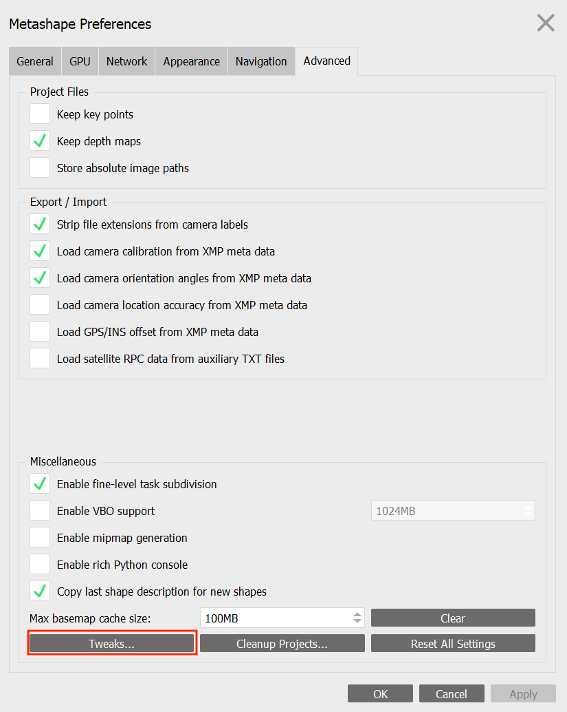
```

```{r metashapetweaks2, echo=FALSE, message=FALSE, fig.cap="Tweaks settings (B).", out.width = '80%', fig.align='center',fig.show = 'hold'}
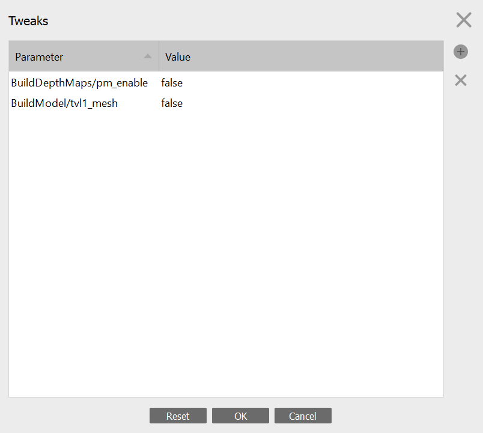
```

## Overview of the model building pipeline

To build a model, we need to do the following steps: (1) Import the
calibrated photos, (2) Apply masks to remove the background of the photos, (3)
Align the photos, (4) Calculate depth maps, (5) Build the 3D model (mesh), and 
(6) Reconstruct the final texture (model color). There could be different approaches 
for each of the steps and options will be given below.

One important thing to consider is whether to align all the photos simultaneously 
or proceed by groups of photos (i.e., "chunks") that correspond to each flower position. 
The first approach is quicker and normally results in more accurate models. 
However, it does not work all the time. We recommend to try the first approach and if it 
fails, to use the alternative approach, which is to divide the pictures in different
\"chunks\" that will create partial 3D models that will be subsequently merged.

## Photo importation

Go to *Workflow*, click on *Add Photos*, and click *Open*. Once the
photos are imported, they are in a single \"chunk\".

To try to align all the photos simultaneously (ideal approach), you need
to arrange them in "Image Groups" ot "Camera Groups" (e.g., select the photos, right click, *Move Images/Cameras* > *New Image/Camera Group*)\*, where each camera group contains
all pictures taken with the same flower orientation and camera angle. Once this is done,
you can add the first photo of each set of photos representing the
label, right click on this photo and select *Disable Cameras* or *Disable Images*\*. This
allows you to not take it into account while reconstructing the model,
but to keep all the information about the flower in your Metashape
project.

\***Note**: Depending on the version of Agisoft Metashape, some functions use either the word 
"camera(s)" (v.<2.0) or "image(s)" (v.>2.0) as far as we know. 

## Mask application

Masks represent selected areas that are excluded from the feature
detection procedure when applied to key points detection. When several
keypoints are detected as the same point (matched as projections of the
same 3D point on different photos), then it is considered as a tie
point. If masks are applied to tie points, then if a key point is masked
in at least one image, it will not be considered. You can thus use a
single or just a few masks with the second method and apply masks to tie
points. It is however possible to automatically apply masks on each
photo to better constrain key point detection and then apply masks to
keypoints. Using masks helps in removing points from being detected in the
background during the image alignment procedure. You can see examples
[here](https://agisoft.freshdesk.com/support/solutions/articles/31000158967-aligning-turntable-photos-with-background-suppression-from-single-mask-in-agisoft-metashape)
on the Agisoft helpdesk portal.

**Step-by-step mask application workflow**

1.  Duplicate one of your photos, and fill it in black (or the main color of your 
    background) in any image manipulation software, and rename it to *background.jpg* 
    or *background.tif* depending on the format of your photos. 
    You can also take a picture of the lightbox without your flower just before
    starting to shoot and use this image as background. This sometimes work better.

2.  Right click on a photo in one of your chunk in your Metashape
    project.

3.  Click on *Masks*, *Import Masks* (Figure \@ref(fig:Metashapemasksrightclick)) and in the box that appears select        the method *From Background* and operation *Replacement*.

4.  Enter the same name as the name of the background image you created in step 1.

5.  Depending on the flower and how contrasting its color is relatively to the background,
    the value for *Tolerance* can vary between approximately 40 and 60 (Figure \@ref(fig:Metashapemaskstolerance)). 
    For some pale flowers you may need a lower tolerance value (e.g. 30 or lower).

6.  Test different values of tolerance on a single photo first and when
    you have a value that is satisfactory (i.e., that creates a mask with the
    border of the flower well defined), you can select *Apply to \> Entire workspace*.

7.  Click *OK*.

8.  This will automatically produce masks around the flowers for all the
    photos in all your chunks. This is why we need a contrasting background color 
    behind the flower.

9.  Check for masks that need touch ups (see next section).

```{r Metashapemasksrightclick, echo=FALSE, message=FALSE, fig.cap="Right click on an image to select a mask to import.", out.width = '100%', fig.align='center',fig.show = 'hold'}
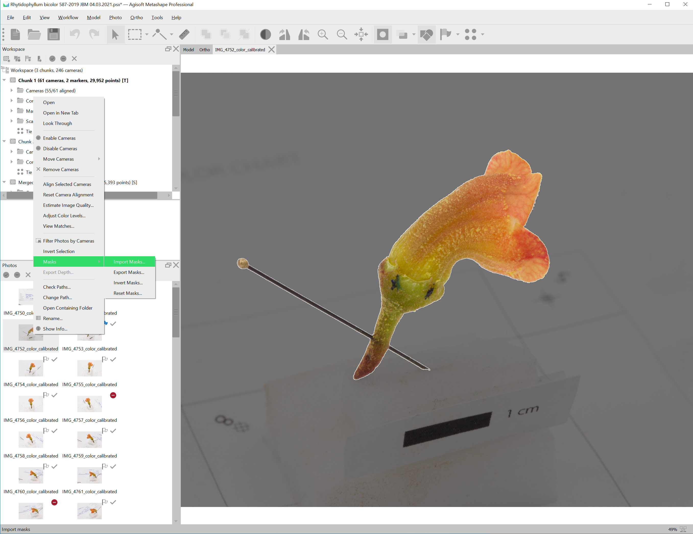
```

```{r Metashapemaskstolerance, echo=FALSE, message=FALSE, fig.cap="Import mask from a black image *background.jpg*, and select a tolerance value, to test on the selected camera (the image you right-clicked on). If the automatic mask is automatically well adjusted around the flower shape (darker gray around the flower), then apply to entire workspace (all the images).", out.width = '100%', fig.align='center',fig.show = 'hold'}
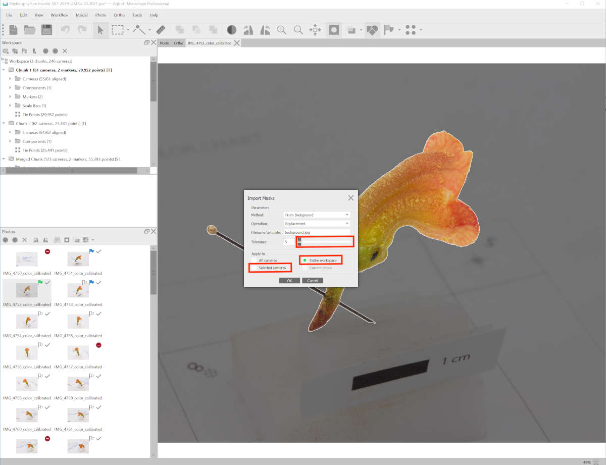
```


**Alternative masking method using Adobe Photoshop**. It is also possible
to use Adobe Photoshop to apply masks. We did not find particular
improvements compared to the Agisoft Metashape approach.

1.  Go to the file containing the pictures of chunk 1. Copy and paste
    this file, naming it accordingly (e.g. *Chunk1-Background*).

2.  Go to Adobe Photoshop version 19.1 and up.

3.  Make a copy of all of the photos you'll be using and place them in a
    new folder labeled *Chunk1-masks*.

4.  Then, you will need to create ONCE a Photoshop action, that will be
    subsequently reused (see Figures \@ref(fig:mask1) to \@ref(fig:mask4) below) :

```{r mask1, echo=FALSE, message=FALSE, fig.cap="Record a new action called *Automatic Mask - 3D reconstruction*.", out.width = '100%', fig.align='center',fig.show = 'hold'}
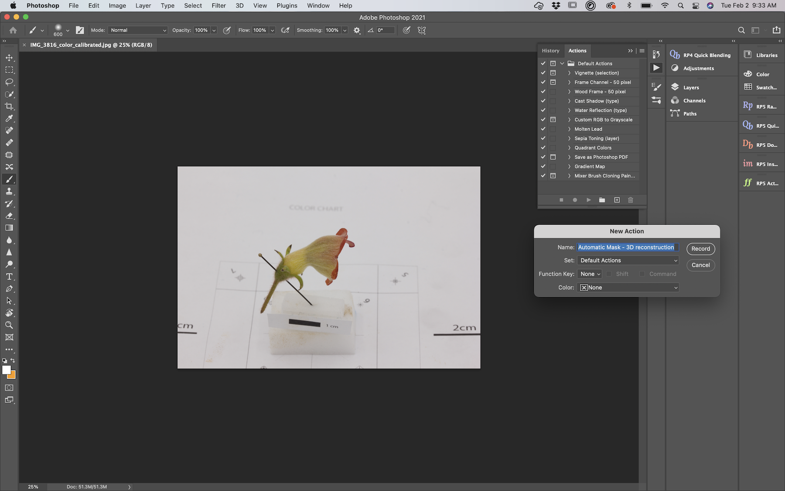
```


```{r mask2, echo=FALSE, message=FALSE, fig.cap="When you reopen your photo, don't forget to remove this extra task in your action.", out.width = '100%', fig.align='center',fig.show = 'hold'}
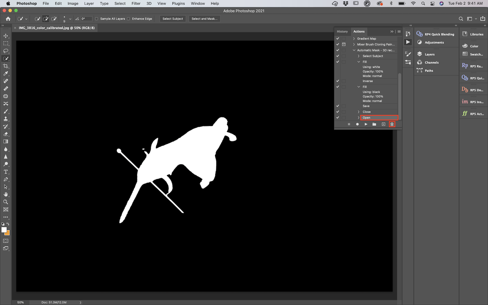
```

```{r mask3, echo=FALSE, message=FALSE, fig.cap="The action should include *Select Subject, Fill, Inverse, Fill, Save, Close*, and you can batch process this action to a specific folder of copied photos to create masks.", out.width = '100%', fig.align='center',fig.show = 'hold'}
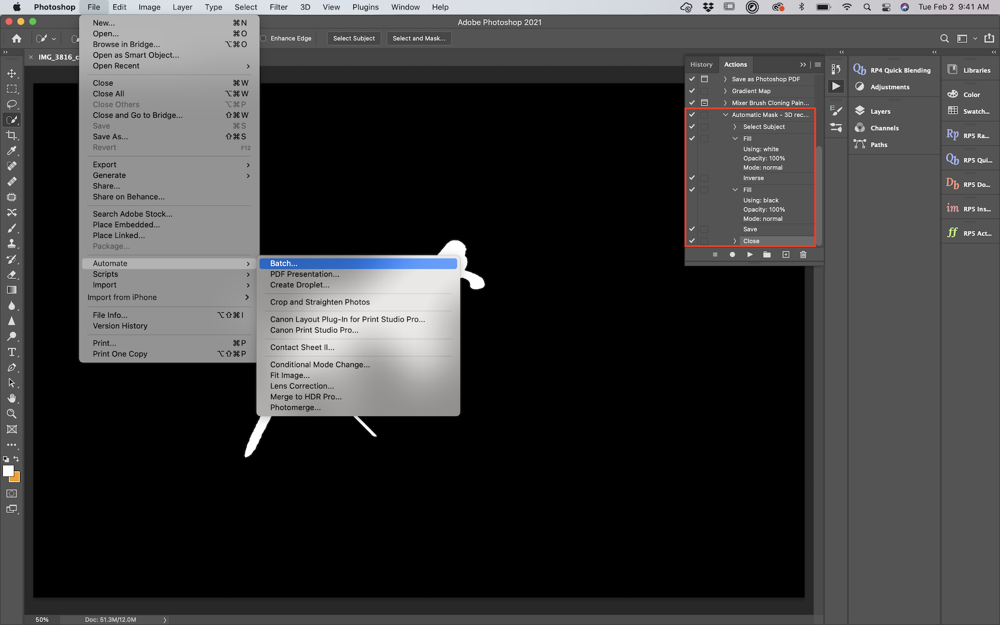
```

```{r mask4, echo=FALSE, message=FALSE, fig.cap="Apply the action to the folder of copied photos called *Chunk1-masks*.", out.width = '100%', fig.align='center',fig.show = 'hold'}
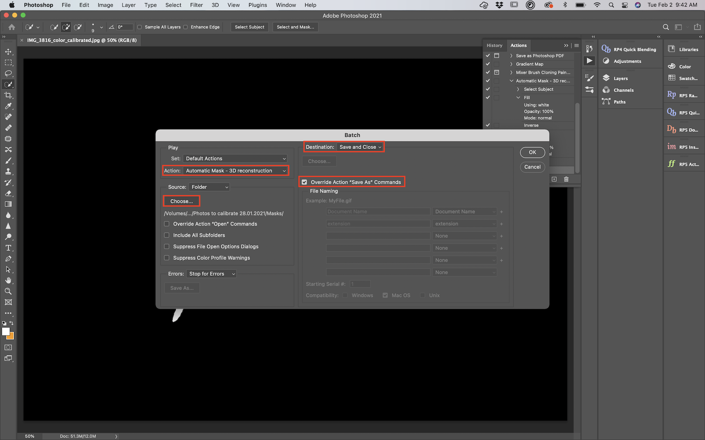
```


5.  Now you should have tranformed all your copied photos into masks,
    with the foreground object in white, and the background in black.

6.  Go to Agisoft Metashape and right click on the first camera (photo)
    of chunk 1. Click on *Masks \> Import Masks* and in the box that
    appears select method *From file*, operation *Replacement*. In
    *Filename Template* use *filename.jpg*. Select *Apply to all
    cameras* and then click *OK*.

7.  Check the masks for touch ups.

## Masks touch ups

The automatic application of masks at the previous steps is sometimes
not entirely satisfactory for all photos. To add parts to the mask (i.e., remove 
them from the model) such as the foam block and the entomological pin, it is possible 
to select them using the selection tools and then add them using the respective 
*Add Selection* button (Figure \@ref(fig:toolsmasks)). Similarly, you can remove or 
invert the selection with the buttons to the right of the *Add Selection* button.

```{r toolsmasks, echo=FALSE, message=FALSE, fig.cap="Selection tools and add selection to mask tool.", out.width = '60%', fig.align='center',fig.show = 'hold'}
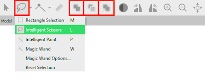
```


## Image alignment

1.  Click on the chunk you want to align, which could comprise several
    image/camera groups.

2.  Make sure to disable photos you don't want (e.g., the label photo, and
    blurry photos) and that the masks are clean.

3.  Go to *Workflow* > *Align Photos* and put the accuracy on *High* or
    *Very high* (do not select the latter if you did focus stacking). To save some time,
    you can check *Generic preselection* in the section *Advanced*. 
    Select *Apply masks* to *Key points* and click *OK*. Note that if you 
    have applied the masks to only some photos, select *Apply masks* to *tie points*.

4.  If you are aligning several chunks of photos, it is possible to run
    this job in batch for each chunk in *Workflow* \> *Batch Process* \>
    *Add* and select the *Job type* as *Align Photos* to apply to
    *All Chunks* or select specific ones (Figure \@ref(fig:batchalign)).

    
```{r batchalign, echo=FALSE, message=FALSE, fig.cap="Align photos in multiple chunks.", out.width = '80%', fig.align='center',fig.show = 'hold'}
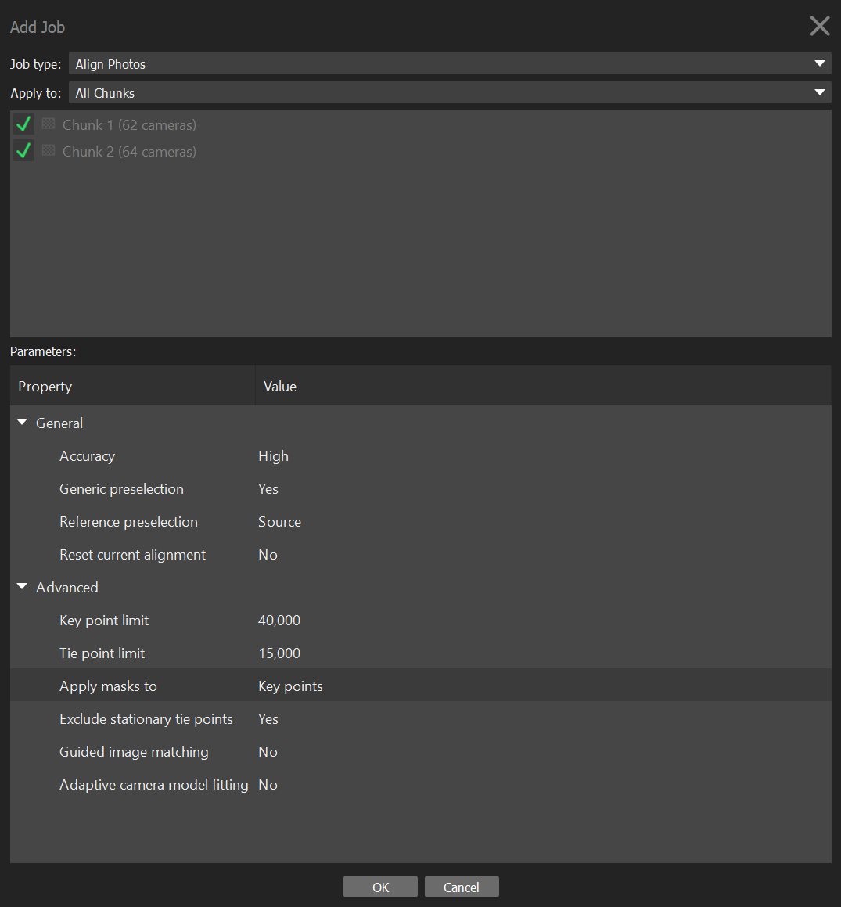
```


5.  **Optional: Align using markers.** If the images cannot
    align properly, it is possible to place homologous markers on the flower, 
    defined as remarkable points (e.g., distinguishable pattern such as color dots 
    on the corolla), or little pen marks at the surface of the
    flower when homologous markers lack. These points need to be
    clearly identifiable on all chunks. You will need at least 5 markers, ideally 
    located at different areas of the flower
    (e.g., near the pedicel, sepal tips, petals). Do not use points
    from the background to align chunks as they are independent from the
    flower (the flower changes position relative to the background).

    1.  With the *Navigation* button selected (i.e., the "cursor" tool at the 
        top), right click on the point you want to add a marker on.

    2.  Click on *Place Marker* \> *New Marker*.

    3.  In the left panel, rename the marker accordingly. Make sure to use the
        same nomenclature on each chunk to be able to merge them
        according to their names.

6.  To help the software recognize the markers, spread them on photos throughout 
    the chunk (it is normally sufficient to manually place them on 2-3 photos and the software 
    normally places them properly on the others, but make sure the markers are all 
    properly placed). 
    
7.  If a marker is not visible in some photos, the flag of this marker should be 
    white or the marker should be blocked on those specific photos. You can do 
    that by right-clicking on the marker on these photos and select *Remove Projection*
    or *Block Marker*.

8.  Repeat these step for each marker.

9.  Go to *Workflow* > *Align Photos* and put the accuracy on *High* or
    *Very high* (the latter only for project without focus stacking). To save some time,
    you can check *Generic preselection* in the section *Advanced*. 
    Select *Apply masks* to *Key points* and click *OK*. Note that if you 
    have applied the masks to only some photos, select *Apply masks* to *Tie points*.

10. **Optional: Alignment optimization using gradual selection and camera positions.** 
    If the camera alignment is not satisfactory, it is possible to clean the tie 
    points obtained and try to re-align the cameras. For instance, in the tie points 
    generated by the alignment, you can delete outlier and imprecise points 
    (Figure \@ref(fig:removepoints1) and  \@ref(fig:removepoints2)):

    1.  In the top menu, click on *Model* and then *Gradual Selection*.
        Select *Reconstruction uncertainty* on *Criterion* and play with
        the *Level* value to remove the uncertain points. The higher the
        value, the worst is the point placed. Values between 30 and 10
        generally give good results. Then *OK*. Press *Delete* (or *fn + Backspace* 
        in Mac) on your keyboard to delete the selected points in red. You don't need
        much more than 10,000 points for good photo alignments.

    2.  After removing uncertain points, go to *View* and click on *Reference* to 
        make the reference panel visible if it is not already. 
        
    3.  Click on the *Optimize Cameras* button (star icon) in the reference panel 
        and in the *Optimize Camera Alignment* window, check all of the cameras in 
        the *General* box and then click *OK* to optimize the camera posistions.

    4.  In *Model \> Gradual Selection*, ensure that *Reprojection
        error* parameter is below 1. If it is not, check if the
        alignment runs well by clicking on the *Show Cameras* button (camera icon)
        on the top (the cameras needs to form a full circle around the flower). 
        If the alignment fails, try to re-align photos by
        following step 3 (don't forget to check the box *Reset Current
        Alignment*). If the alignment didn't fail, go to *Model \>
        Gradual Selection \> Reproduction error*, and set the level to 1
        and click OK. Then press *Delete* (or *fn + Backspace* in Mac).

    5.  Manually remove remaining outlier points using the selection tools.

11. Repeat these steps for each chunk.

```{r removepoints1, echo=FALSE, message=FALSE, fig.cap="Use the selection tool to remove background points.", out.width = '100%', fig.align='center',fig.show = 'hold'}
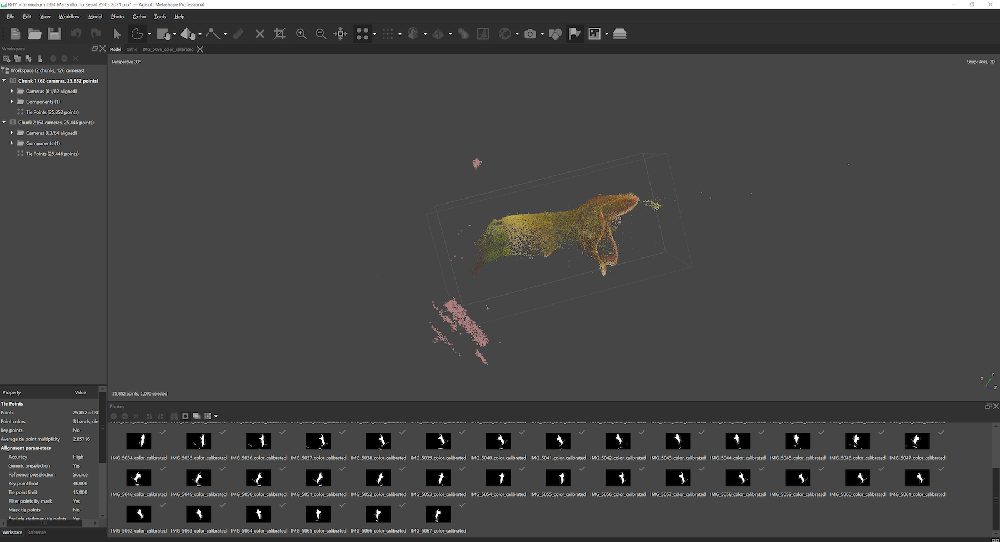
```

```{r removepoints2, echo=FALSE, message=FALSE, fig.cap="Use the gradual selection tool to remove additional mis-calculated points.", out.width = '100%', fig.align='center',fig.show = 'hold'}
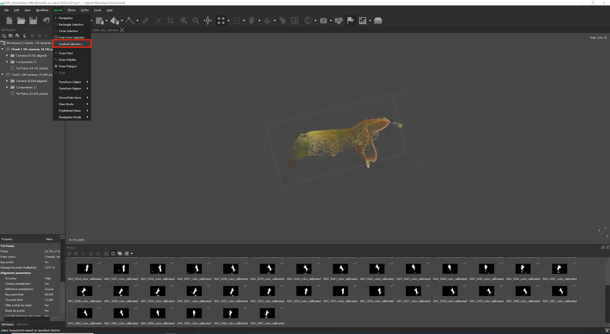
```


\***Note**: If the alignment fails using only one chunk and two or more
camera groups, then it will be necessary to divide your job into several
chunks. Each chunk should then contain photos from one flower position.
Once the chunks are ready, you can proceed with the alignment following
the previous steps.


## Align chunks together

<span style="color: red;">**Note: This step is only necessary if your project is divided into several chunks.**</span>

At this step, it is important to align the different chunks with each
other before they can be combined in a complete model. There are two
ways to do this: using tie points (does not work every time) or using markers.

- To align using tie points:

1.  Select one of the chunks that you would like to align.

2.  Go to *Workflow* \> *Align Chunks*, select all the chunks you want to
    align together and set the method as *Point based* (Figure \@ref(fig:alignchunks)).

3.  Restrict the key points with masks.

4.  Click on *OK*.

- To align using markers:

1.  Place homologous markers on the flower, defined as remarkable points
    (e.g., distinguishable pattern such as color dots on the
    corolla), or little pen marks at the surface of the
    flower when homologous markers lack. These points need to be
    clearly identifiable on all chunks. You will need at least 5 markers, ideally 
    located at different areas of the flower
    (e.g., near the pedicel, sepal tips, petals). Do not use points
    from the background to align chunks as they are independent from the
    flower (the flower changes position relative to the background).

    1.  With the *Navigation* button selected (i.e., the cursor icon tool), 
        right click on the point you want to add a marker on.

    2.  Click on *Place Marker* \> *New Marker*.

    3.  In the left panel, rename the marker accordingly. Make sure to use the
        same nomenclature on each chunk to be able to merge them
        according to their names.


2.  To help the software recognize the markers, spread them on photos throughout 
    the chunk (it is normally sufficient to manually place them on 2-3 photos and the software 
    normally places them properly on the others, but make sure the markers are all 
    properly placed). 
    
3.  If a marker is not visible in some photos, the flag of this marker should be 
    white or the marker should be blocked on those specific photos. You can do 
    that by right-clicking on the marker on these photos and select *Remove Projection*
    or *Block Marker*.

4.  Repeat these step for each marker and each chunk.

5.  Select one chunk. Go to *Workflow \> Align Chunks*, select the
    chunks you want to align, set the method as *Marker based* and then
    click *OK*.

When the chunks are aligned, a [T] is put at the end of your chunk
name to notify that it is transformed. You can check the alignment using
the icon to show aligned chunks (i.e., the icon of layers on top of each others,
Figure \@ref(fig:showalignedchunks)). The different chunks should be well
aligned over the whole flower. If the alignment of your chunks is
unsatisfactory, try to place more markers on recognizable features and
spread across the whole flower. Additionally, you can manually align
chunks using the tools to move the models in the space, but this is
highly not recommended.


```{r alignchunks, echo=FALSE, message=FALSE, fig.cap="Align chunks.", out.width = '50%', fig.align='center',fig.show = 'hold'}
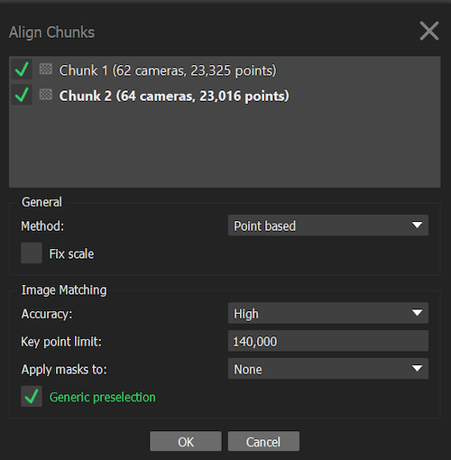
```
```{r showalignedchunks, echo=FALSE, message=FALSE, fig.cap="Show aligned chunks to verify their positions.", out.width = '100%', fig.align='center',fig.show = 'hold'}
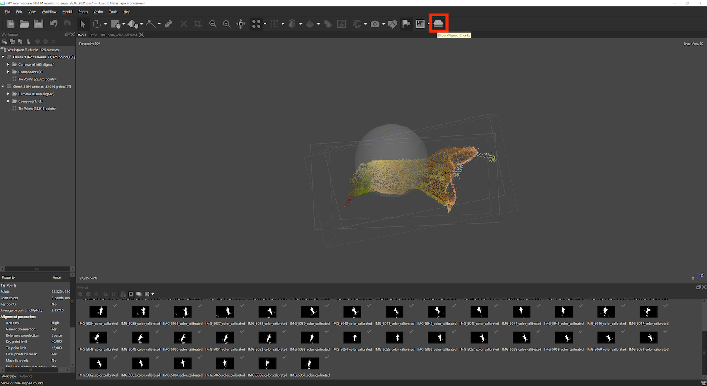
```

## Merge chunks

<span style="color: red;">**Note: This step is only necessary if your project is divided into several chunks.**</span>

The next step is to merge chunks together when they are well aligned.
Click on *Workflow \> Merge chunks*, and merge using either the tie
point method or the marker method depending on the option selected
above.

## Build 3D mesh

1.  Select the chunk or the merged chunks for which you want to build a
    3D mesh (model).

2.  Go to *Workflow \> Build Mesh*.

3.  In the dialog box, make sure that *Source Data* is on *Depth maps*,
    *Quality* and *Face Count* on *High* (Figure \@ref(fig:build3Dmesh)).
    Note that although it is also possible to generate a mesh from a
    dense point cloud (which has to be built separately), the depth maps
    provide better results for objects with a high number of minor
    details.

4.  Then go to *Advanced*, check *Calculate vertex colors* and click *OK*.

5.  Once the mesh is produced, you should remove the pin and extra
    floating background parts using the selection tool. This will
    highlight the selection in red. 

6.  Verify your selection and press *Delete* (or *fn + Backspace*) to remove them.


```{r build3Dmesh, echo=FALSE, message=FALSE, fig.cap="Build 3D mesh.", out.width = '50%', fig.align='center',fig.show = 'hold'}
knitr::include_graphics("Figures/metashape_build_mesh.png")
```


>Our protocol merges the chunks to build a tie point model of all chunks
before constructing a model for the merge chunk. We found that this is
the best approach, although it is also possible to build models for each
chunk separately and then merge these models to obtain a full model.


## 3D mesh touch ups

1.  You can smooth the mesh by clicking on *Tools*, *Mesh*, *Smooth Mesh*. 
    You can also duplicate a 3D model to save one intact
    (right click on it and un-check *Use as default* to keep it as an
    archived model). If you smooth a mesh, you can't undo it.

2.  You can fill holes in your mesh by clicking on *Tools \> Mesh \> Close Holes*. 
    Note that if your holes are too big, the closing function can create unwanted 
    structures. Similarly to smoothing, you cannot undo closing holes in the mesh. 
    **HOWEVER**, this will remove the vertex colors in version 1.7.2, which we will need to
    place landmarks when doing the morphometrics.

## Build texture

To build the texture go to *Workflow \> Build Texture*, use the preset
values and click *OK*.

## Scaling

To scale the model, go to the pictures of your merged chunk and follow
these steps:

1.  On a picture displaying the scale bar, add new markers at each end
    of the scale bar and on a couple of additional photos.

2.  In the left panel, select both markers, right click on them and select 
    *Create Scale Bar*.

3.  If the reference panel is not already visible on the left, go to *View* and click on 
    *Reference*. Go to the reference panel, select the scale under *Scale Bars* and write 
    0.01 in the *Distance (m)* column (except if your scale bar has a different length, 
    in which case, add the respective value of its length in meters).

4.  Click on the *Update Transform* button in the reference panel (icon of two 
    rotating arrows). This is an important step, because otherwise the scale will 
    not be incorporated to your model.

5.  To verify if the scale is taken into account, you can use the
    *Ruler* tool and select two points on your mesh to measure the distance between them.
    
```{r adds-cale, echo=FALSE, message=FALSE, fig.cap="Scaling. Top arrow: Markers added at each end of the scale bar (i.e., at the 0 cm and 1 cm points). Middle Arrow: *Update Transform* button. Bottom arrow: Input of scale bar length in meters. Small red box (top): Ruler tool. Large red box (bottom): Reference panel.", out.width = '75%', fig.align='center',fig.show = 'hold'}
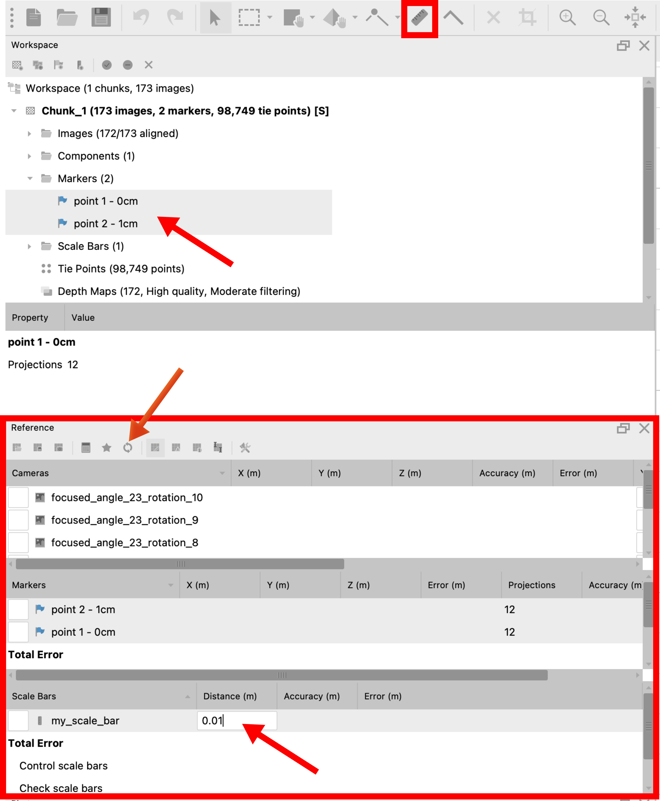
```

## Model orientation

1.  In Metashape, be sure that *Show Info* and *Show Grid* in *Model \> Show/Hide Items*
    are checked. You should see at the bottom right of the model panel
    the 3D axes.

2.  Make sure that the scale is correct because changing it will affect
    the coordinates of the 3D model and you will need to re-orient it. You can 
    verify the scale using the *Ruler* tool.

3.  Use the *Navigation* tool to orient these 3D axes (x should be at 0° and y should be at 90°; Figure         \@ref(fig:orientation-tools)).

4.  Once you orient the 3D axes in the wanted direction, you can then
    use the tool *Move Object* to put the flower in the 
    center of the grid (the cross in the center point of the grid should be hidden 
    in the central point of the 3D model; Figure \@ref(fig:orientation-tools) and Figure \@ref(fig:model-orientation)).
    
5.  To orient the model, use the *Rotate Object*. The model should be facing the right side of the grid (the direction 
    of the x axis; Figure \@ref(fig:orientation-tools) and Figure \@ref(fig:model-orientation)).

6.  Orient the binding box as well, using the *Move Region*, *Resize Region* and *Rotate Region* 
    tools. The side with the cross on the box should be on the ventral side of the 
    flower, and the side with the two dashes should be facing the opening of the flower. 
    Note that depending on the software you use to open the model, the first view
    orientation may change when you open the final object file (Figure \@ref(fig:binding-box-tools)).
    
```{r orientation-tools, echo=FALSE, message=FALSE, fig.cap="Object (model) orientation tools. Left box: *Navigation* tool. Left box group: Object orientation tools. Arrow: Desired 3D axes orientation.", out.width = '100%', fig.align='center',fig.show = 'hold'}
knitr::include_graphics("Figures/Object_orientation_tools.png")
```

```{r model-orientation, echo=FALSE, message=FALSE, fig.cap="Desired model orientation on the grid.", out.width = '100%', fig.align='center',fig.show = 'hold'}
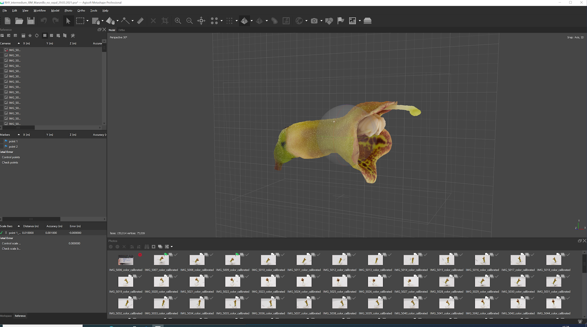
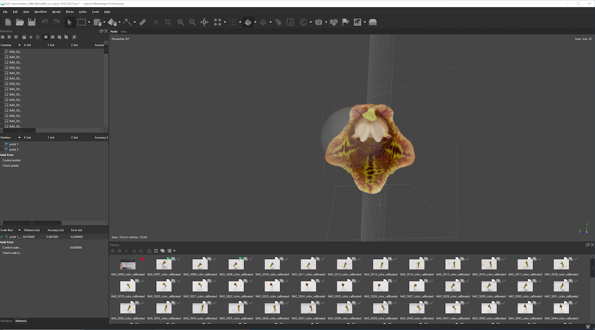
```

```{r binding-box-tools, echo=FALSE, message=FALSE, fig.cap="Binding box orientation tools. Box group: Binding box orientation tools. Arrows: The cross and the two dashes on two different sides of the binding box.", out.width = '100%', fig.align='center',fig.show = 'hold'}
knitr::include_graphics("Figures/Binding_box_tools.png")
```


## Export model and texture

1.  You can export your 3D model by clicking on *File* \> *Export* \>
    *Export Model*.

2.  Name your model.

3.  Choose *.ply* as the extension.

4.  In the dialog box, tick the *Vertex colors*. This option will allow
    you to get color on the actual 3D model.

5.  Select *Export texture* as PNG.

6.  Make sure to export the texture with transparency, by ticking the
    *Write alpha channel* or *Save alpha channel* option (depending on the Agisoft 
    Metashape version). The texture is a separate file with detailed color 
    information that is wrapped on the model.

7.  Click on *OK*.
