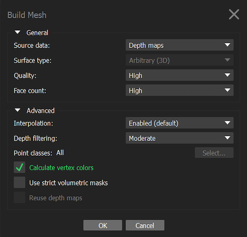

# 3D model reconstruction in Agisoft Metashape

## Download Agisoft Metashape

Download the Agisoft Metashape professional edition software
[here](https://www.agisoft.com/downloads/installer/). Make sure that
your computer fills the [minimum system
requirements](https://www.agisoft.com/downloads/system-requirements/).
The standard edition doesn't allow the use of the scale option that we
will need to add a scale on our models.

```{r agisoft, echo=FALSE, message=FALSE, fig.cap="Agisoft Metashape", out.width = '20%', fig.align='center'}
knitr::include_graphics("Figures/logo_metashape.jpeg")
```

## Initial tweaks

Agisoft Metashape can use graphic cards at certain steps of the model
construction such as image matching and depth maps calculation. To
enable the use of the graphic hardware (GPU):

-   Select Preferences command from the Tools menu.

-   In Preferences dialog select GPU tab.

-   Select available GPU devices in GPU tab of the Preferences window

This step has to be done only once.

This protocol has been elaborated using the version 1.7.1 of Agisoft
Metashape. The latest version of Metashape is now version 1.8.2, but we
still made the following changes. In order to obtain accurate thin
structures, such as petal margin, and avoid holes in your mesh in
Agisoft Metashape 1.5.x or later (up to our knowlege) you will need to
activate ONCE the *Visibility consistent mesh* function in *Tools \>
Preferences \> Advanced \>Tweaks*, then *Add* and fill in *Parameters*
with *BuildModel/tvl1_mesh* and select the value as *False* (figure \@ref(fig:metashapetweaks1)). Additionally, to use the anterior
version of the depth maps generation process, add ONCE the tweak :
*BuildDepthMaps/pm_enable* and set the value to *False* (figure \@ref(fig:metashapetweaks2)).

```{r metashapetweaks1, echo=FALSE, message=FALSE, fig.cap="Tweaks settings", out.width = '80%', fig.align='center',fig.show = 'hold'}
knitr::include_graphics("Figures/Metashape_tweaks_1.png")
```

```{r metashapetweaks2, echo=FALSE, message=FALSE, fig.cap="Tweaks settings", out.width = '80%', fig.align='center',fig.show = 'hold'}
knitr::include_graphics("Figures/Metashape_tweaks_2.png")
```

## Overview of the model building pipeline

To build a model, we need to do the following steps: 1) Import the
calibrated photos, 2) apply masks to remove background on the photos, 3)
align the cameras, 4) calculate depth maps, 5) build the 3D model
(mesh), and 6) reconstruct the final texture (model color). There could
be different approaches for each of the steps and options will be given
below.

One important note is whether all the pictures (cameras) are aligned
simultaneously of if it is necessary to proceed by groups of pictures
that correspond to each flower positions. The first approach is quicker
and normally results in more accurate models. However, it does not work
all the times. We recommend to try it first and if it fails to use the
alternative approach, which is to divide the pictures in different
\"chunks\" that will create partial 3D models.

## Photo importation

Go to *Workflow*, click on *Add Photos*, and click *Open*. Once the
photos are imported, they are in a single \"chunk\", which is a group of
photos.

To try to align all the photos simultaneously (ideal approach), you need
to arrange them in \"camera groups\", where each camera group contains
all pictures taken with the same flower orientation. Once this is done,
you can add the first photo of each set of photos representing the
label, and right click on this photo and select *disable cameras*. This
allows you to not take it into account while reconstructing the model,
but to keep all the information about the flower in your Metashape
project.

## Mask application

Masks represent selected areas that are excluded from the feature
detection procedure when applied to key points detection. When several
keypoints are detected as the same point (matched as projections of the
same 3D point on different photos), then it is considered as a tie
point. If masks are applied to tie points, then if a key point is masked
in at least one image, it will not be considered. You can thus use a
single or just a few masks with the second method (apply masks to tie
points). It is however possible to automatically apply masks on each
photo to better constrain key point detection (apply masks to
keypoints). Using masks helps in removing points to be detected in the
background during image alignment procedure. You can see examples
[here](https://agisoft.freshdesk.com/support/solutions/articles/31000158967-aligning-turntable-photos-with-background-suppression-from-single-mask-in-agisoft-metashape)
on the Agisoft helpdesk portal.

**Step-by-step mask application workflow**

1.  Duplicate one of your photos, and fill it in black in any image
    manipulation software, and rename it as *background.jpg*. You can
    also take a picture of the lightbox without your flower just before
    starting to shoot and use this image as background. This sometimes
    work better.

2.  Right click on a photo in one of your chunk in your Metashape
    project.

3.  Click on *Masks*, *Import Masks* (Figure \@ref(fig:Metashapemasksrightclick)) and in the box that appears select method \"From Background\", operation *Replacement*.

4.  Enter the same name as the name of your background you just saved.

5.  Depending on the flower, the value for *Tolerance* can vary between
    approximately 40 and 60 (Figure \@ref(fig:Metashapemaskstolerance)). For some pale flowers you may need a lower tolerance value (e.g. 30).

6.  Test different values of tolerance on a single photo first, but when
    you have a value that is satisfactory (that create a masks with the
    border of the flower well defined) you can select *Apply to entire
    workspace*

7.  Click OK

8.  This will automatically produce masks around the flowers for all the
    photos in all your chunks. This is why we need a contrasting white
    background behind the flower.

9.  Check for masks that need touch ups (next section).

```{r Metashapemasksrightclick, echo=FALSE, message=FALSE, fig.cap="Right click on an image to select a mask to import.", out.width = '100%', fig.align='center',fig.show = 'hold'}

```

```{r Metashapemaskstolerance, echo=FALSE, message=FALSE, fig.cap="Import mask from a black image *background.jpg*, and select a tolerance value, to test on the selected camera (the image you right-clicked on). If the automatic mask is automatically well adjusted around the flower shape (darker gray around the flower), then apply to entire workspace (all the images).", out.width = '100%', fig.align='center',fig.show = 'hold'}
knitr::include_graphics("Figures/Metashape_masks_tolerance.png")
```


**Alternative masking method using Adobe Photoshop** It is also possible
to use Adobe Photoshop to apply masks. We did not find particular
improvements compared to the Agisoft Metashape approach.

1.  Go to the file containing the pictures of chunk 1. Copy and paste
    this file, naming it accordingly (e.g. *Chunk1-Background*).

2.  Go to Adobe Photoshop version 19.1 and up.

3.  Make a copy of all of the photos you'll be using and place them in a
    new folder labeled *Chunk1-masks*.

4.  Then, you will need to create ONCE a Photoshop action, that will be
    subsequently reused (see Figures \@ref(fig:mask1) to \@ref(fig:mask4) below) :

```{r mask1, echo=FALSE, message=FALSE, fig.cap="Record a new action called *Automatic Mask - 3D reconstruction*", out.width = '100%', fig.align='center',fig.show = 'hold'}
knitr::include_graphics("Figures/mask_1.png")
```


```{r mask2, echo=FALSE, message=FALSE, fig.cap="When you reopen your photo, don't forget to remove this extra task in your action.", out.width = '100%', fig.align='center',fig.show = 'hold'}
knitr::include_graphics("Figures/mask_2.png")
```

```{r mask3, echo=FALSE, message=FALSE, fig.cap="The action should include *Select Subject, Fill, Inverse, Fill, Save, Close*, and you can batch process this action to a specific folder of copied photos to create masks.", out.width = '100%', fig.align='center',fig.show = 'hold'}
knitr::include_graphics("Figures/mask_3.png")
```

```{r mask4, echo=FALSE, message=FALSE, fig.cap="Apply the action to the folder of copied photos called *Chunk1-masks*.", out.width = '100%', fig.align='center',fig.show = 'hold'}
knitr::include_graphics("Figures/mask_4.png")
```


5.  Now you should have tranformed all your copied photos into masks,
    with the foreground object in white, and the background in black.

6.  Go to Agisoft Metashape and right click on the first camera (photo)
    of chunk 1. Click on *Masks \> Import Masks* and in the box that
    appears select method *From file*, operation *Replacement*. In
    *Filename Template* use *filename.jpg*. Select *Apply to all
    cameras* and then click *OK*.

7.  Check the masks for touch ups.

## Masks touch ups

The automatic application of masks at the previous steps is sometimes
not entirely satisfactory for all photos. It is possible to add or
remove parts of masks using the selection tool and the add/remove/invert
buttons (Figure \@ref(fig:toolsmasks)). You can then use the selection tools to
select areas that are not the flower and add the selection to the mask
(Figure  \@ref(fig:toolsmasks)). You also remove the scale and the
entomological pin at this step. Additionally, you can invert the
selection, or remove the selected areas from the mask with the icons on
the right hand side of the add to mask icon.

```{r toolsmasks, echo=FALSE, message=FALSE, fig.cap="Selection tools and add selection to mask tool.", out.width = '60%', fig.align='center',fig.show = 'hold'}
knitr::include_graphics("Figures/tools_masks.png")
```


## Camera alignment

1.  Click on the chunk you want to align, which could comprise several
    camera groups.

2.  Make sure to disable photos you don't want (the label photo, and
    blurry photos) and that the masks are clean.

3.  Go to *Workflow*, *Align Photos* and put the accuracy on *High* or
    *Very high*. In the section *Advanced*, check *Generic
    pre-selection*, and select *Apply masks* to *key points*, and click
    *OK*. Note that if you have applied the masks to only some photos,
    select *Apply masks* to *tie points*.

4.  If you are aligning several chunks of photos, it is possible to run
    this job in batch for each chunk in *workflow* \> *batch process* \>
    *Add* button \> select the *job type* as *Align photos* to apply to
    *all chunks* or select specific ones \> add parameters listed above
    (Figure \@ref(fig:batchalign)).

    
```{r batchalign, echo=FALSE, message=FALSE, fig.cap="Align photos in multiple chunks.", out.width = '80%', fig.align='center',fig.show = 'hold'}
knitr::include_graphics("Figures/metashape_batch_align.png")
```


5.  **Optional: align using markers** If the different camera cannot
    align properly, it is possible to place homologous markers on the
    flower, defined as remarkable points on the flower (distinguishable
    pattern such as color dots on the corolla, for example), or by
    little pen marks at the surface of the flower when homologous
    markers lacks. These points need to be clearly identifiable on all
    camera groups. You will need at least 5 markers per flower, ideally
    positioned in different regions of the flower (e.g., near the
    peduncle, sepals tips, petals). Do not use points from the
    background to align chunks as it is independent from the flower (the
    flower changes position relative to the background).

    1.  Right click on the picture

    2.  Then click on *Place Marker* \> *New Marker*.

    3.  In the left panel, rename them accordingly. Make sure to use the
        same nomenclature on each chunk to be able to merge them
        according to their names.

6.  To help the software recognize the markers, spread the manual
    markers on photos throughout the chunk (It is normally sufficient to
    place it on 2-3 photos and the software normally places them
    properly on the others, but make sure the markers are all properly
    placed).

7.  Repeat the step for each marker and each chunk.

8.  Select one chunk. Go to *Workflow \> Align Chunks*, select the
    chunks you want to align, set the method as *Markers based* and then
    click *OK*. Repeat for all chunks to align.

9.  **Optional** If the camera alignment is not satisfactory, it is
    possible to clean the tie point obtained and try to realign the
    cameras. For instance, on the tie point generated by the alignment,
    you can delete outlier and imprecise points (Figure \@ref(fig:removepoints1) and  \@ref(fig:removepoints2)):

    1.  In the top menu, click on *Model* and then *Gradual Selection*.
        Select *Reconstruction uncertainty* on *Criterion* and play with
        the *Level* value to remove the uncertain points. The higher the
        value, the worst is the point placed. Values between 30 and 10
        generally give good results. Then *OK*. Press *Delete* on your
        keyboard to delete the selected points in red. You don't need
        much more than 10,000 points for good photo alignments.

    2.  After removing uncertain points, go to the *Reference* panel and
        click on *Optimize Camera* to optimize camera position. Select
        all of the cameras.

    3.  In *Model \> Gradual Selection*, ensure that *Reprojection
        error* parameter is below 1. If it is not, check if the
        alignment runs well (camera needs to form a full circle above
        the object). If the alignment fails, try to re-align photos by
        following step 3 (don't forget to check the box \"reset current
        alignment\"). If the alignment didn't fail, go to *Model \>
        Gradual Selection \> Reproduction error*, and set the level to 1
        and click OK. Then press *Delete*.

    4.  Manually remove remaining outliers using the selection tool.

10. Repeat these steps for each chunk.

```{r removepoints1, echo=FALSE, message=FALSE, fig.cap="Use the selection tool to remove background points.", out.width = '100%', fig.align='center',fig.show = 'hold'}
knitr::include_graphics("Figures/metashape_delete_selectedpoints.png")
```

```{r removepoints2, echo=FALSE, message=FALSE, fig.cap="Use the gradual selection tool to remove additional mis-calculated points", out.width = '100%', fig.align='center',fig.show = 'hold'}
knitr::include_graphics("Figures/metashape_gradual_selection.png")
```


> If the alignment fails using only one chunk and two or more
camera groups, then it will be necessary to divide your job in several
chunks. Each chunk should then contain photos from one flower position.
Once the chunks are ready, you can proceed with the alignment following
the previous steps.**


## Align chunks together

**Note: This step is only necessary if your project is divided in
several chunks.**

At this step, it is important to align the different chunks with each
other before they can be combined in a complete model. There are two
ways to do this. The approach using tie points is quick but does not
work all the time. If it fails, you will have to use the approach using
markers.

To align using tie points :

1.  Select the chunks to align together.

2.  Go to *Workflow* \> *Align Chunks*, select the chunks you want to
    align together, set the method as *Point based* (Figure \@ref(fig:alignchunks)).

3.  Restrict the key points with masks.

4.  Click on *OK*.

To align using markers :

1.  Place homologous markers on the flower, defined as remarkable points
    on the flower (distinguishable pattern such as color dots on the
    corolla, for example), or by little pen marks at the surface of the
    flower when homologous markers lacks. These points need to be
    clearly identifiable on all chunks. You will need at least 5 markers
    per flower, ideally positioned in different regions of the flower
    (e.g., near the peduncle, sepals tips, petals). Do not use points
    from the background to align chunks as it is independent from the
    flower (the flower changes position relative to the background).

    1.  Right click on the picture

    2.  Then click on *Place Marker* \> *New Marker*.

    3.  In the left panel, rename them accordingly. Make sure to use the
        same nomenclature on each chunk to be able to merge them
        according to their names.

2.  To help the software recognize the markers, spread the manual
    markers on photos throughout the chunk (It is normally sufficient to
    place it on 2-3 photos and the software normally places them
    properly on the others, but make sure the markers are all properly
    placed).

3.  Repeat the step for each marker and each chunk.

4.  Select one chunk. Go to *Workflow \> Align Chunks*, select the
    chunks you want to align, set the method as *Markers based* and then
    click *OK*. Repeat for all chunks to align.

When the chunks are aligned, a [T] is put at the end of your chunk
name to notify that it is transformed. You can check the alignment using
the icon to show aligned chunks (icon of layers on top of each others,
Figure \@ref(fig:showalignedchunks)). The different chunks should be well
aligned over the whole flower. If the alignment of your chunks is
unsatisfactory, try to place more markers on recognizable features and
spread across the whole flower. Additionally, you can manually align
chunks using the tools to move the models in the space, but this is
highly not recommended.


```{r alignchunks, echo=FALSE, message=FALSE, fig.cap="Align chunks.", out.width = '50%', fig.align='center',fig.show = 'hold'}
knitr::include_graphics("Figures/metashape_align_chunks.png")
```
```{r showalignedchunks, echo=FALSE, message=FALSE, fig.cap="Show aligned chunks to verify their positions.", out.width = '100%', fig.align='center',fig.show = 'hold'}
knitr::include_graphics("Figures/metashape_show_aligned_chunks.png")
```

## Merge chunks

**Note: This step is only necessary if your project is divided in
several chunks.**

The next step is to merge chunks together when they are well aligned.
Click on *Workflow \> Merge chunks*, and merge using either the tie
point method or the markers method depending on the option selected
above.

## Build 3D mesh

1.  Select the chunk or the merged chunks for which you want to build a
    3D mesh (model).

2.  Go to *Workflow \> Build Mesh*.

3.  In the dialog box, make sure that *Source Data* is on *Depth maps*,
    *Quality* and *Face Count* on *High* (Figure \@ref(fig:build3Dmesh)).
    Note that although it is also possible to generate a mesh from a
    dense point cloud (which has to be built separately), the depth maps
    provide better results for objects with a high number of minor
    details.

4.  Then go to *Advanced*, check *Calculate vertex colors*. Click OK.

5.  Once the mesh is produced, you should remove the pin and extra
    floating background parts using the selection tool. This will
    highlight the selection in red.

6.  Verify your selection and press delete to remove them.


```{r build3Dmesh, echo=FALSE, message=FALSE, fig.cap="Build 3D mesh.", out.width = '50%', fig.align='center',fig.show = 'hold'}

```


>Our protocol merges the chunks to build a tie point model of all chunks
before constructing a model for the merge chunk. We found that this is
the best approach, although it is also possible to build models for each
chunk separately and then merge these models to obtain a full model.


## 3D mesh touch ups

1.  You can smooth the mesh by clicking on *Tools*, *Mesh*, *Smooth
    Mesh*. You can also duplicate a 3D model to save one intact, and
    right click on it, and un-check *Use as default* to keep it as an
    archived model. If you smooth a mesh, you can't undo it.

2.  You can fill holes in your mesh by clicking on *Tools \> Mesh \>
    Close Holes*. Note that if your holes are too big, the closing
    function can create unwanted structures. Similarly as the smoothing,
    you can't undo closing holes in the mesh. **HOWEVER**, this will
    remove the vertex colors in version 1.7.2, which we will need to
    place landmarks when doing the morphometrics.

## Build texture

To build the texture : *Workflow \> Build Texture*, use the preset
values and click OK.

## Scaling

To scale the model, go to the pictures of your merged chunk and follow
these steps :

1.  On a picture displaying the scale bar, add new markers at each end
    of the scale bar and on a couple of additional photos.

2.  In the left panel, select both markers and click on the icon *Add
    scale* (Figure \@ref(fig:addscale)).

3.  Go to the *Reference* panel, select the scale and add 0.01 as
    reference.

4.  Click on the *Update transform* button (rotating arrows). This is an
    important step, because otherwise the scale will not be incorporated
    to your model.

5.  To verify if the scale is taken into account, you can use the
    measuring tape tool.


```{r addscale, echo=FALSE, message=FALSE, fig.cap="Add a scale using landmarks", out.width = '100%', fig.align='center',fig.show = 'hold'}
knitr::include_graphics("Figures/metashape_add_scale_2.png")
```


## Model orientation

1.  In Metashape, be sure that *Show info* in *Model \> Show/Hide Items*
    is checked. You should see at the bottom right of the model panel
    the 3D axes.

2.  Show grid

3.  Make sure that the scale is the right one, changing it will affect
    the coordinates of the 3D model. You can verify the scale using the
    measuring tool.

4.  Use the navigation tool to orient these 3D axes.

5.  Once you orient the 3D axes in the wanted direction, you can then
    use the tool *Rotate Object* to put the object in the wanted
    direction, and at the center of the grid, facing the right side of
    the grid.

6.  Orient the binding box as well with the cross on the ventral side,
    and the two dash facing the opening of the flower. Note that
    depending on the software you use to open the model, the first view
    orientation may change when you open the final object file.
    
    
```{r orientation, echo=FALSE, message=FALSE, fig.cap="Add a scale using landmarks", out.width = '100%', fig.align='center',fig.show = 'hold'}
knitr::include_graphics("Figures/metashape_orientation.png")

```


## Export model and texture

1.  You can export your 3D model by clicking on *File* \> *Export* \>
    *Export Model*.

2.  Name your model

3.  Choose .ply as the extension.

4.  In the dialog box, tick the *Vertex colors*. This option will allow
    you to get color on the actual 3D model.

5.  Select *Export texture* as PNG.

6.  Make sure to export the texture with transparency, by ticking the
    *Write alpha channel* option. The texture is a separate file, with
    detail color information that is wrapped on the model.

7.  Click on *OK*.
