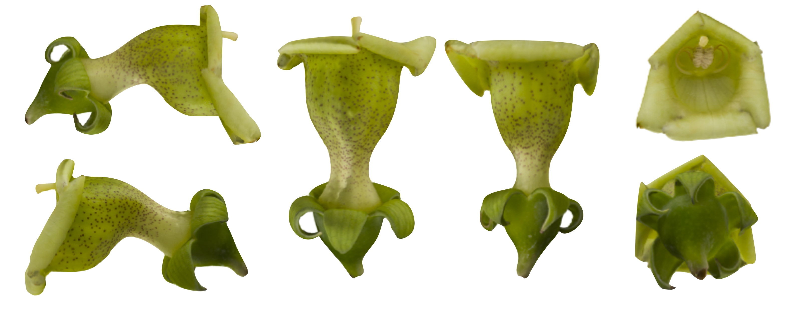

--- 
title: "Flower photogrammetry and 3D modeling protocol"
author:
- Marion Leménager
- Jérôme Burkiewicz
- Loudmila Jelinscaia Lagou
- Daniel Schoen
- Diana Constanza Diaz Cardona
- Simon Joly
date: "`r Sys.Date()`"
site: bookdown::bookdown_site
documentclass: book
bibliography:
- book.bib
url: "http://www.plantevolution.org/photogrammetry-protocol/"
cover-image: Figures/cover.jpg
description: |
  This protocol is an evolving protocol used in the Joly lab at the Université de Montréal (Canada)
link-citations: yes
github-repo: "plantevolution/photogrammetry-protocol"
---

# About

This protocol is an evolving protocol used in the [Joly lab](www.plantevolution.org) at the Université de Montréal (Canada)

This protocol describes how to obtain three-dimensional (3D) reconstructions of flowers using photogrammetry. It describes in details the set-up, settings and steps that has worked for us for building accurate flower models, but other approaches are certainly possible. Hence, we hope this protocol serves as a starting point rather than a final protocol. We welcome any comments.

{width="100%"}

## Citation

Leménager, M., J. Burkiewicz, D. J. Schoen, S. Joly. Studying flowers in 3D using photogrammetry. New Phytologist. 237(5): 1922-1933.

## Contributing

This protocol was produced with bookdown and is [hosted on github]( https://github.com/plantevolution/photogrammetry-protocol). Please do not hesitate to fork the protocol, modify it and make pull requests to improve it!

## Disclaimer

We provide this protocol as guidelines, without any guaranty. It has worked well for us for many types of flowers, but there is no guaranty that it will work on all flowers.